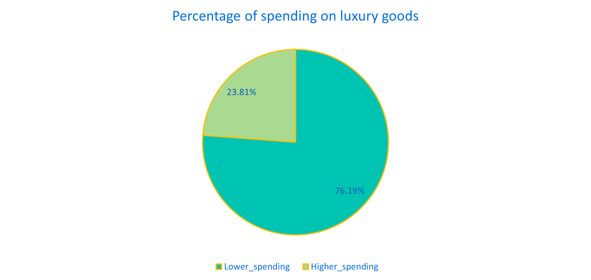
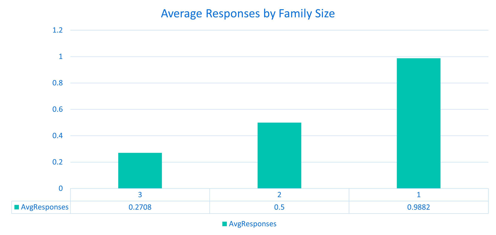

<link rel="stylesheet" href="styles.css" type="text/css">
<link rel="stylesheet" href="site_libs/academicons-1.9.1/css/academicons.min.css"/>

<br><br><br>

## **Customer Personality Analysis**


<br>


<br><br><br>

### 1. Visualization & Summary - Business Questions 

<br><br>

1. What is the distribution of customers across different income ranges, and how does it correlate with their education level? 

<p align="center">

</p>
<p align="center">
</p>

+ The education variable is a categorical variable with 5 educational levels such as basic, 2nd cycle, graduation, master and Ph.D. As shown in the results, customers with a basic education level are predominantly in the low-income level. Particularly, customers in the upper-middle income and high-income group are absent from the basic education category. Most customers are classified at the graduation level as shown on the bar chart. Among these, 50% of the customers belong to upper-middle income and high-income groups, possessing the highest numbers in both income levels compared to other education levels. Additionally, the proportions of upper-middle income and high-income groups increase as education level progress from basic and 2nd cycle to Graduation, Master and Ph.D. In conclusion, the correlation between education level and income level exists. When customers have higher education levels, they are more likely to belong to higher income groups. In contrast, when customers have lower education level, they are more likely to fall into lower income groups. 

<br><br>

2. What is the average recency of activity for customers grouped by marital status? 

<p align="center">

</p>
<p align="center">
</p>

+ The marital_status variable is a categorical variable with 8 values. Some customers did not expose their status which is represented as ‘Unknown’. Recency means the number of days since a customer’s last purchase. This business question investigates whether customers’ marital status affect their shopping frequency. If the recency is low, this indicates customers shop more frequently compared to those with higher recency. As shown in the bar chart, customers who are classified as ‘Alone’ and ‘YOLO’ have the lowest recency, indicating that they shop more frequently compared to other marital statuses. Particularly, customers who are classified as ‘YOLO’ exhibit an extremely low recency, shopping approximately every 3 days on average. On the other hand, the average recency for other customer groups ranges between 30 and 50 days. Interestingly, I expected customers with families to shop more frequently than customers living alone. However, customers with partners categorized as ‘Together’ or ‘Married’ tend to have longer recency periods, averaging over one month between purchases. 

<br><br>

3. What percentage of customers who complained have higher spending on luxury goods like wines and gold products?

<p align="center">

</p>
<p align="center">
</p>


+ This business question investigates whether customers who complained to this company within the last 2 years exhibit higher spending on luxury goods. I initially hypothesized that there could be a correlation between complaints and higher spending on luxury items because customers purchasing luxury items usually have higher expectations which could increase the likelihood of customers’ complaints. I extracted data for customers who complained within the last 2 years and analyzed their total amount of spending on luxury items for each customer. The criteria dividing spending into lower or higher spending is based on the average amount spent on luxury items of non-complaint customers. If their spending is over the average spending of non-complaint customers, they are classified as higher spenders on luxury items and vice versus. Contrary to my expectation, only 23.81% of customers who purchased luxury items complained within the last 2 years, indicating there isn’t any strong correlation between complaints and spending on luxury goods. 

<br><br>

4. Does family size affect the likelihood of responding to campaigns?

<p align="center">

</p>
<p align="center">
</p>

+ This business question investigates whether there is a clear correlation between family size and campaign response. To analyze this, I used the marital_status to distinguish family sizes into three groups such as 1, 2, and 3 by combining marital_status with the number of kids in their household. In addition, I created a new ‘TotalResponses’ variable to sum all campaign acceptance variables and calculate the average responses for each family size group. As shown in the bar chart, when the number of family size increases, the average response to campaigns decreases. The number of family size is inversely proportional to campaign response rates. Customers living alone without kids are more likely to respond campaigns, while larger families are less engaged with marketing campaigns. 

<br><br>

5. Which campaigns are most successful? 

<p align="center">

</p>
<p align="center">
</p>

+ This business question investigates which campaign attracted more customer responses among 6 campaign related variables. As shown in the bar chart, the last campaign has the highest response rate compared to all other campaigns. In contrast, the first and second campaigns exhibit the lowest campaign rates, indicating that customers are less likely to respond to earlier marketing campaigns. Their responses gradually increase over campaigns and peak at the last campaign. We cannot guess why this exactly happened but the later marketing campaigns are more effective that the earlier ones. 

<br><br>

6. What is the total spending by customers across all campaigns, and how does it compare by the first campaign acceptance? 

<p align="center">

</p>
<p align="center">
</p>

+ This business question investigates which campaign was the most effective based on their total spending for products. I created a new Response variable assigning customers to the campaign which they responded for the first time. For example, if customers responded to the last campaign for the first time, they belonged to the last campaign. As shown in the results, the last campaign achieved the highest total spending on products compared to all other campaigns, followed by the first campaign. This suggests that the last campaign effectively attracted more customer responses and successfully converted them into purchases. Interestingly, the first campaign did not attract a large number of customer responses, many customers purchased products, resulting in high total spending. In contrast, the second campaign exhibited the poorest performance among all other campaigns, which attracted the lowest number of customer responses and conversions.

<br><br>

7. Which month had the highest number of new customer registrations and how were the registration patterns?

<p align="center">

</p>
<p align="center">
</p>

+ This business question investigates whether there is a recognizable customer registration pattern to assess. If there is a month where customer registration sharply dropped, it should be reviewed internally and identify potential reasons to address this issue. As shown on the line graph, the customer registration dropped sharply between May and July for 2 months and then it went up in Aug, showing the highest number of new customer registrations. The registration patterns exhibit similar patterns during the entire months even with minor fluctuations except for significant declines in both June and July which should be reviewed internally to identify what exactly dropped the customer registrations. 

<br><br>

(8) How consistent is the spending behavior of customers across different product categories over the last two years?

<p align="center">

</p>
<p align="center">
</p>

+ This business question investigates whether customers with distinct average spending within the last 2 years on products exhibit different coefficient of variation in their spending patterns. I calculated each customer’s average spending on products and their corresponding CV values. The Coefficient of Variation (CV) indicates the consistency of customers’ spending patterns. If customers have higher CVs, it indicates they primarily focus on purchasing specific product categories. In contrast, if customers have lower CVs, it indicates they balanced their purchases and are more likely to evenly purchase diverse products.  As shown on the graph, X-axis represents the average spending on products and Y-axis represents their CV values. When the average spending is lower, CVs are dispersed whereas the average spending is higher, CVs are more centered and their values become lower, indicating that customer spending more on average tend to evenly purchase diverse products. 


<br><br><br>

### 2. Report

Please click [HERE](files/report.pdf) for the full analysis report. 

<br><br><br>

### 3. MySQL Code

```{r setup-connection, include=FALSE}
library(DBI)
library(RMySQL)

# Create a database connection
con <- dbConnect(
  RMySQL::MySQL(),
  dbname = "MarketingCampaign",
  host = "localhost",        # Replace with your database host
  user = "root",    # Replace with your database username
  password = "!Tjwlgus1324" # Replace with your database password
)
dbIsValid(con)
```
```{sql, connection=con}

-- Business questions 1. Customer Demographics Analysis
-- Q1.  What is the distribution of customers across different income ranges, and how does it correlate with their education level? 
 
SELECT CASE
         WHEN income < 30000 THEN 'LOW INCOME'
         WHEN income BETWEEN 30000 AND 50000 THEN 'LOWER-MIDDLE INCOME'
         WHEN income BETWEEN 50001 AND 70000 THEN 'UPPER-MIDDLE INCOME'
         ELSE 'HIGH INCOME'
	   END AS IncomeRange,
       education_level AS Education_level,
       COUNT(customer_id) AS Customer_Count
FROM customer
GROUP BY CASE 
           WHEN income < 30000 THEN 'LOW INCOME'
           WHEN income BETWEEN 30000 AND 50000 THEN 'LOWER-MIDDLE INCOME'
           WHEN income BETWEEN 50001 AND 70000 THEN 'UPPER-MIDDLE INCOME'
		   ELSE 'HIGH INCOME'
         END,
         education_level
ORDER BY IncomeRange, Education_level;
```

```{sql, connection=con}
-- Business questions 2. Activity Recency
-- Q2.   What is the average recency of activity for customers grouped by marital status?

SELECT status AS marital_status
     , AVG(recency) AS AvgRecency
FROM customer_activity c
 INNER JOIN marital_status m ON c.customer_id = m.customer_id 
GROUP BY marital_status
ORDER BY 2 DESC;
```


```{sql, connection=con}
-- Business questions 3. Complaint Trends
-- Q3.  What percentage of customers who complained have higher spending on luxury goods like wines and gold products?
# Average Luxury spending for non-complaint customers 
WITH NonComplainAvg AS (
SELECT AVG(p.MntWines + p.MntGoldProds) AS AvgLuxurySpending 
FROM complain c
 INNER JOIN customer_activity cu ON c.activity_id = cu.activity_id
 INNER JOIN customer cus ON cu.customer_id = cus.customer_id
 INNER JOIN customer_method cm ON cus.customer_id = cm.customer_id
 INNER JOIN product_purchase p ON cm.purchase_method_id = p.purchase_method_id
WHERE c.complain = 0 # Non complaint customers 
),
ComplainLuxurySpending AS (
 SELECT (p.MntWines + p.MntGoldProds) AS TotalLuxurySpending_complains 
 FROM complain c 
  INNER JOIN customer_activity cu ON c.activity_id = cu.activity_id
  INNER JOIN customer cus ON cu.customer_id = cus.customer_id
  INNER JOIN customer_method cm ON cus.customer_id = cm.customer_id
  INNER JOIN product_purchase p ON cm.purchase_method_id = p.purchase_method_id
 WHERE c.complain = 1
)
SELECT CASE
         WHEN TotalLuxurySpending_complains  > (SELECT AvgLuxurySpending FROM NonComplainAvg) THEN 'Higher_spending'
         ELSE 'Lower_spending'
	   END AS HigherSpendingCustomer_in_complain
     , COUNT(*) AS Customer_Count 
     , CONCAT(ROUND(COUNT(*) * 100 / SUM(COUNT(*)) OVER (), 2), '%') AS Percentage
FROM ComplainLuxurySpending
GROUP BY HigherSpendingCustomer_in_complain;
```

```{sql, connection=con}
-- Business questions 4. Campaign Response by Family Size
-- Q4.   Does family size affect the likelihood of responding to campaigns? If so, which campaigns are most successful? 
WITH KidsAndTeens AS (
SELECT marital_status_id
     , CASE
         WHEN kid_home > 0 OR teen_home > 0 THEN 1 
         ELSE 0
		END AS HaskidsOrTeens
FROM customer_kids
),
MaritalStatus AS (
SELECT marital_status_id  
     , customer_id
     , CASE
         WHEN Status = 'Married' THEN 2
         WHEN Status = 'Single' THEN 1
         WHEN Status = 'Together' THEN 2
         WHEN Status = 'Divorced' THEN 1
         ELSE 1
	   END AS MaritalStatusScore
FROM marital_status
),
FamilySize AS (
SELECT k.marital_status_id
     , m.customer_id
     , k.HaskidsOrTeens
     , m.MaritalStatusScore
     , (k.HaskidsOrTeens + m.MaritalStatusScore) AS FamilySize
FROM KidsAndTeens k
 INNER JOIN MaritalStatus m ON k.marital_status_id = m.marital_status_id
),
CampaignResponseFamilySize AS (
SELECT c.customer_id
     , f.marital_status_id
     , f.HasKidsOrTeens
     , f.FamilySize
     , (AcceptedCmp1 + AcceptedCmp2 + AcceptedCmp3 + AcceptedCmp4 + AcceptedCmp5 + Response) AS TotalResponses
FROM campaign_response c
 INNER JOIN FamilySize f ON c.customer_id = f.customer_id
)
SELECT FamilySize
     , AVG(TotalResponses) AS AvgResponses
FROM CampaignResponseFamilySize
GROUP BY FamilySize
ORDER BY FamilySize DESC;
```

```{sql, connection=con}
-- Business questions 5. Campaign Response Rate
-- Q5. which campaigns are most successful? 

WITH CampaignResponses AS (
SELECT SUM(AcceptedCmp1) AS TotalAcceptedCmp1
     , SUM(AcceptedCmp2) AS TotalAcceptedCmp2
     , SUM(AcceptedCmp3) AS TotalAcceptedCmp3
     , SUM(AcceptedCmp4) AS TotalAcceptedCmp4
     , SUM(AcceptedCmp5) AS TotalAcceptedCmp5
     , SUM(Response) AS TotalAcceptedLastCampaign
	 , COUNT(customer_id) AS TotalCustomers 
FROM campaign_response
) 
SELECT 'Campaign1' AS Campaign
      , TotalAcceptedCmp1 / TotalCustomers  AS ResponseRate
FROM CampaignResponses
UNION ALL
SELECT 'Campaign2' AS Campaign
     , TotalAcceptedCmp2 / TotalCustomers AS ResponseRate
FROM CampaignResponses
UNION ALL
SELECT 'Campaign3' AS Campaign
     , TotalAcceptedCmp3 / TotalCustomers AS ResponseRate
FROM CampaignResponses
UNION ALL
SELECT 'Campaign4' AS Campaign
     , TotalAcceptedCmp4 / TotalCustomers AS ResponseRate
FROM CampaignResponses
UNION ALL
SELECT 'Campaign5' AS Campaign
     , TotalAcceptedCmp5 / TotalCustomers AS ResponseRate
FROM CampaignResponses
UNION ALL
SELECT 'CampaignLast' AS Campaign
     , TotalAcceptedLastCampaign / TotalCustomers AS ResponseRate
FROM CampaignResponses
ORDER BY ResponseRate DESC;
```

```{sql, connection=con}
-- Business questions 6.  Customer Lifetime Value (CLTV) Indicators
-- Q6.  What is the average spending for customers segmented by their first campaign acceptance?

WITH TotalSpending AS (
SELECT p.purchase_method_id
     , c.customer_id
     , (p.MntFishProducts + p.MntFruits + p.MntGoldProds + p.MntMeatProducts + p.MntWines) AS TotalSpending
FROM product_purchase p
 INNER JOIN customer_method c ON p.purchase_method_id = c.purchase_method_id
),
CampaignAccepted AS (
SELECT customer_id
     , CASE 
          WHEN AcceptedCmp1 = 1 THEN 'Campaign 1'
          WHEN AcceptedCmp2 = 1 THEN 'Campaign 2'
          WHEN AcceptedCmp3 = 1 THEN 'Campaign 3'
          WHEN AcceptedCmp4 = 1 THEN 'Campaign 4'
          WHEN AcceptedCmp5 = 1 THEN 'Campaign 5'
          ELSE 'Last Campaign Accepted'
		END AS CampaignAcceptedResponse
FROM campaign_response
)
SELECT ca.CampaignAcceptedResponse
     , FORMAT(SUM(t.TotalSpending), 2) AS TotalSpendingbyResponse
FROM TotalSpending t
 INNER JOIN CampaignAccepted ca ON t.customer_id = ca.customer_id
GROUP BY ca.CampaignAcceptedResponse
ORDER BY 2 DESC;
```

```{sql, connection=con}
-- Business questions 7.  New Customers 
-- Q7.   Which month had the highest number of new customer registrations?
WITH MonthData AS (
SELECT customer_id
     , MONTH(dt_customer) AS Month
FROM customer_activity
)
SELECT m.Month
     , COUNT(c.customer_id) AS CustomerRegistration
FROM customer c
 INNER JOIN MonthData m ON c.customer_id = m.customer_id
GROUP BY m.Month
ORDER BY 2 DESC;
```

```{sql, connection=con}
-- Business questions 8. Spending Consistency
-- Q8.   How consistent is the spending behavior of customers across different product categories over the last two years? 

WITH CustomerSpendingdata AS (
SELECT c.customer_id
     , SUM(p.MntWines) AS TotalWines 
     , SUM(p.MntFishProducts) AS TotalFish
     , SUM(p.MntFruits) AS TotalFruits
     , SUM(p.MntGoldProds) AS TotalGold
     , SUM(p.MntMeatProducts) AS TotalMeat
     , SUM(p.MntSweetProducts) AS TotalSweet 
FROM product_purchase p
 INNER JOIN customer_method c ON p.purchase_method_id = c.purchase_method_id
GROUP BY c.customer_id
),
CustomerMeanSTDdata AS (
SELECT customer_id 
     , (TotalWines + TotalFish + TotalFruits + TotalGold + TotalMeat + TotalSweet) / 6 AS AverageSpending
     , SQRT(
            POWER(TotalWines - ((TotalWines + TotalFish + TotalFruits + TotalGold + TotalMeat + TotalSweet) / 6), 2) +
            POWER(TotalFish - ((TotalWines + TotalFish + TotalFruits + TotalGold + TotalMeat + TotalSweet) / 6), 2) + 
            POWER(TotalFruits - ((TotalWines + TotalFish + TotalFruits + TotalGold + TotalMeat + TotalSweet) / 6), 2) +
            POWER(TotalGold - ((TotalWines + TotalFish + TotalFruits + TotalGold + TotalMeat + TotalSweet) / 6), 2) +
            POWER(TotalMeat - ((TotalWines + TotalFish + TotalFruits + TotalGold + TotalMeat + TotalSweet) / 6), 2) +
            POWER(TotalSweet - ((TotalWines + TotalFish + TotalFruits + TotalGold + TotalMeat + TotalSweet) / 6), 2) 
            ) / 6 AS STDSpending
FROM CustomerSpendingdata
)
SELECT customer_id
     , AverageSpending
     , STDSpending
     , CASE
         WHEN AverageSpending = 0 THEN NULL
         ELSE STDSpending / AverageSpending 
       END AS COV # Coefficient of Variation   
FROM CustomerMeanSTDdata ;
```


