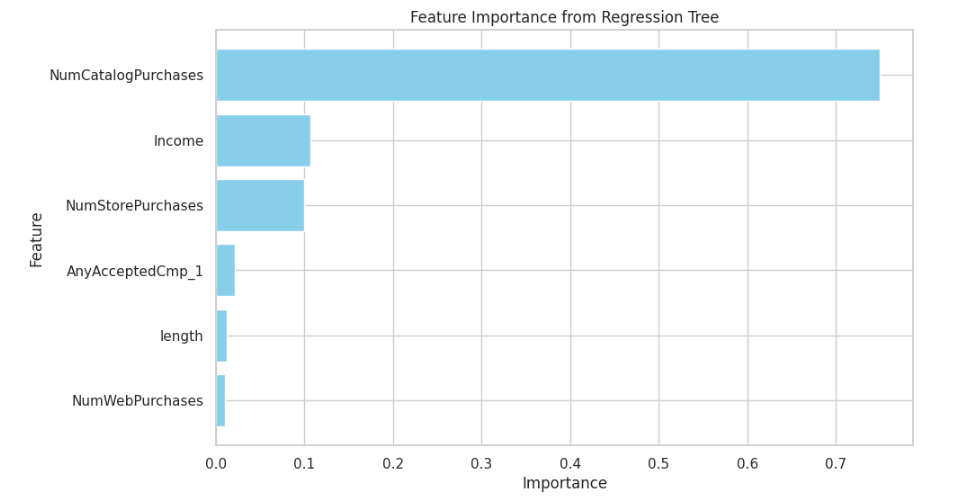
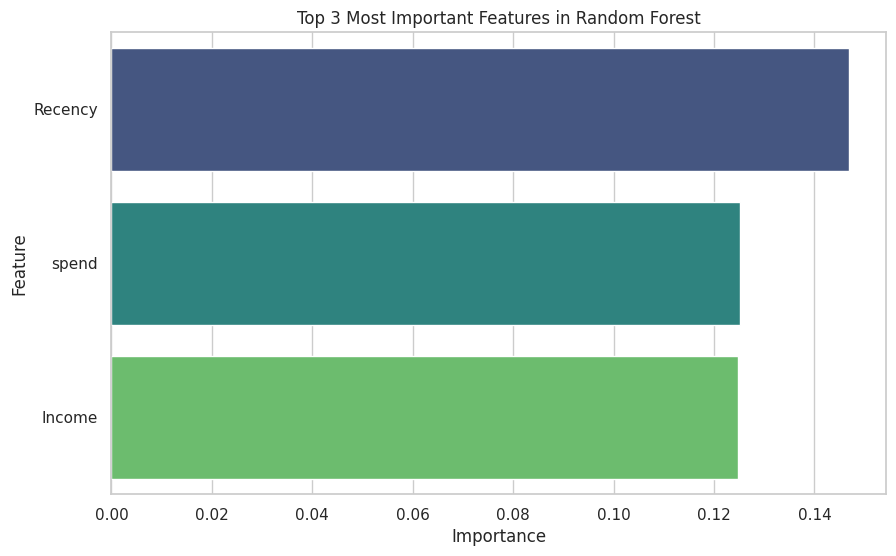

<link rel="stylesheet" href="styles.css" type="text/css">
<link rel="stylesheet" href="site_libs/academicons-1.9.1/css/academicons.min.css"/>

   

## **Predicting Campaign Offer Acceptance**

 

   

### 1. Figure

[Fig. CART Regression features by importance]

 

[Fig. Random Forest features by importance]

 

| Model                | Accuracy | F1 Score | AUC  |
|----------------------|----------|----------|------|
| Logistic Regression  | 0.88     | 0.47     | 0.87 |
| Decision Tree        | 0.83     | 0.43     | 0.67 |
| Random Forest        | 0.89     | 0.51     | 0.88 |
| KNN                  | 0.87     | 0.40     | 0.82 |

[Table. Model Performance Comparison]

  

### 2. Goal
Understanding customers is crucial for creating effective marketing strategies by predicting high-potential customers who are most likely to respond to marketing campaigns while optimizing limited resources. I aim to improve campaign efficiency by classifying customers into distinct spending groups and accurately predicting customer responses to the most recent marketing campaign using historical marketing campaign response data and customer demographic information. To achieve this goal, I separated data analysis into 2 different parts. First, I used CART regression and K-means clustering for customer segmentation depending on their spending on products. I analyzed customer data from the retail industry to segment customers on their spending behavior. This segmentation identifies which spending groups are more likely to respond to marketing campaigns and highlights effective marketing channels for targeting specific groups. Second, I used several machine learning models to predict customer responses to the last marketing campaign. I divided the entire dataset into a train and test dataset to evaluate each model performance and select the best-performing model based on several metrics such as accuracy, precision and recall. 

 

### 3. Methodology & Summary

#### (1) Customer Segmentation

  + CART regression and K-means clustering were used to segment customers.
  + Stepwise regression identified multicollinearity and heteroscedasticity issues, so CART regression was preferred.
  + Final predictors included catalog purchases, income, store purchases, AnyAcceptedCmp, length, and web purchases.
  + Customers were segmented into Low Spender, Medium Spender, High Spender, and Very High Spender. Medium Spenders exhibited the highest predicted spending.
  + Recommendation: Target Medium and High Spenders through catalog campaigns to boost conversions.
  
#### (2) Classfication

  + Tested machine learning models: Logistic Regression, Decision Tree, Random Forest, and KNN.
  + Focus: Improve responder classification accuracy.
  + Evaluation metrics: Accuracy (overall performance), F1 Score (balance of precision and recall), and AUC (distinguishing responders vs. non-responders).
  + Observations: Class imbalance affected responder F1-scores, which were lower than non-responders.
  + Random Forest was selected as the best predictive model due to its superior performance in Accuracy, F1 Score, and AUC metrics.
  + While Random Forest achieved high overall scores, the F1-score for responders remained relatively low due to class imbalance.

  
 

### 4. Code

Please click [HERE](https://nbviewer.org/github/JennyJihyunSeo/jennyjihyunseo.github.io/blob/main/Customer_Personality_Analysis.ipynb) for the code.

 

### 5. Report 

Please click [HERE](files/report_Python.pdf) for the full analysis report. 

 

