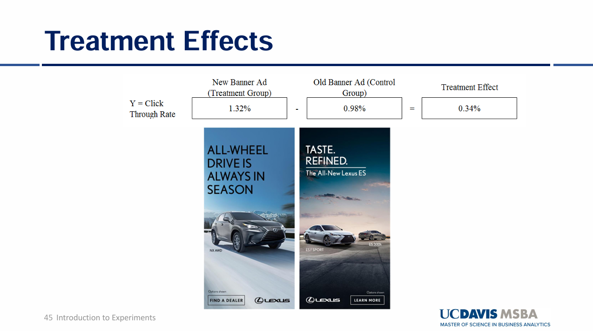
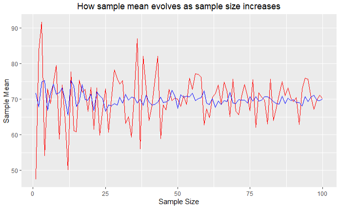
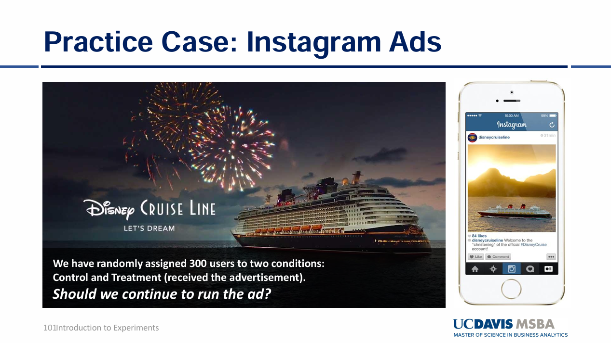
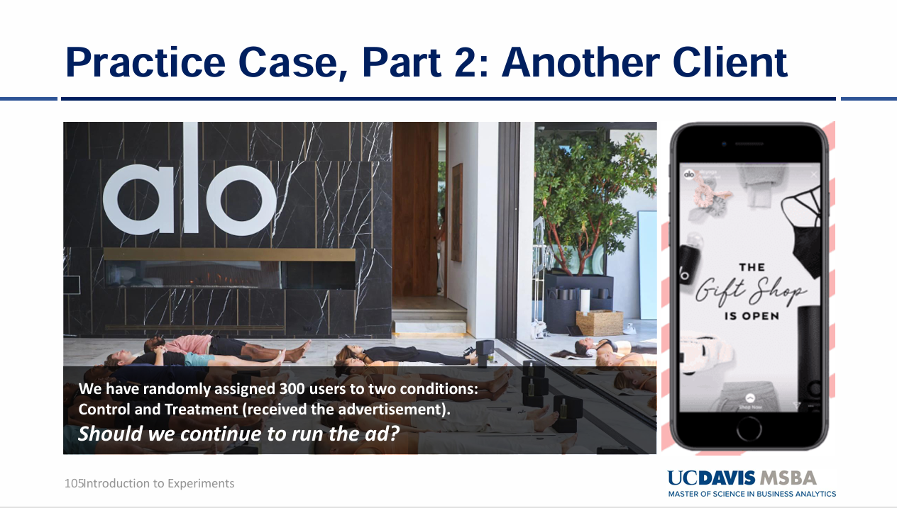

<link rel="stylesheet" href="styles.css" type="text/css">
<link rel="stylesheet" href="site_libs/academicons-1.9.1/css/academicons.min.css"/>

<br><br><br>

---
title: "Statistics using R"
---

<br><br><br>

## 1. Hypothesis Testing with Two-Sample Proportion Test


<br>

### 1. Figure

<p align="center">

</p>
<p align="center">
[Fig. Treatment Effects between New banner Ad and Old Banner Ad]
</p>


<br>

<br><br>

### 2. Goal

To test if the Click-Through-Rate (CTR) difference between Ad B (treatment group) and Ad A (Control group). 

<br>

### 3. Hypotheses

**Null Hypothesis (H₀):**
- The null hypothesis indicates Ad B is not effective than Ad A
- The null hypothesis indicates the CTR (Click through Rate) of Ad B is less than or equal to the CTR (Click through Rate) of Ad A
$$
H_0: p_B \leq p_A
$$

**Alternative Hypothesis (H₁):**
- The null hypothesis indicates Ad B is more effective than Ad A
- The null hypothesis indicates the CTR (Click through Rate) of Ad B is more than the CTR of Ad A 
$$
H_1: p_B > p_A
$$

<br>

### 4. Methodology & Summary

  + Two Sample proportion z-test was used: 
     + Ad A and Ad B each had 500 samples.
     + Success = clicking the ad (CTR).
     + CTR of Ad A = 3% CTR and Ad B = 5.6% CTR. 
     + Result: p-value = 0.0307 rejecting the null hypothesis.
     
  + Conclusion: At a 0.05 significance level, the p-value of 0.0307 indicates that the null hypothesis (Ad B is not more effective than Ad A) can be rejected. The p-value represents the probability of observing a result as extreme as, or more extreme than, the current outcome under the assumption that the null hypothesis is true. Since the p-value is less than the significance level, we have sufficient evidence to reject the null hypothesis, suggesting that Ad B is statistically significantly more effective than Ad A.


<br>

### 5. Code

```{r}
#Q1
### Set seed to ensure we consistently generate the same results
set.seed(1)

### Create two random samples of A and B with sample size 500 respectively 
### A and B are distributed binomial with sample means 0.03 and 0.05
### A and B follow binomial distributions while indicating 1 is success (clicking the Ad) and 0 is failure (not clicking the Ad)
nbin <- 500
A <- data.frame(CTR = rbinom(n = nbin, prob = 0.03, size = 1))
B <- data.frame(CTR = rbinom(n = nbin, prob = 0.05, size = 1))

### Sample counts, counting the success of clicking the Ad.
countA <- sum(A$CTR)
countB <- sum(B$CTR)

### Two-sample proportions z-test with one-sided test 
prop.test(x = c(countB, countA), 
          n = c(nbin, nbin), 
          alternative = "greater")

# Ad B is clicked 5% otherwise Ad A is clicked 3% on the time but this is very unlikely (only 3% based on the p-value) that 
# this outcome can be gained under the assumption that the null hypothesis is true. Therefore, we suspect that the null hypothesis is not true.
```

<br>

<br><br><br>

## 2. Hypothesis Testing with 10,000 Random Samples 


<br>


<br><br><br>

### 1. Figure

<p align="center">

</p>
<p align="center">
[Fig. Treatment Effects between New banner Ad and Old Banner Ad]
</p>


<br>

<br><br>

### 2. Goal
To test if the mean Click-Through-Rate (CTR) between Ad A and Ad B is greater than 2.6%.

<br>

### 3. Hypotheses

**Null Hypothesis (H₀):**

The mean difference in CTR between Ad B and Ad A is **less than or equal to 2.6%**:

$$
H_0: \mu_B - \mu_A \leq 0.026
$$

**Alternative Hypothesis (H₁):**

The mean difference in CTR between Ad B and Ad A is **greater than 2.6%**:

$$
H_1: \mu_B - \mu_A > 0.026
$$

<br>

### 4. Methodology & Summary

  + Two Sample proportion z-test was used: 
     + 10,000 random samples of size 500 were drawn for both Ad A and Ad B, assuming both had a mean CTR of 4.3%, which indicates that those samples are simulated under the assumption that the null hypothesis is true as the mean of each distribution is the same as each other. 
     + The mean CTR difference was calculated.
     + If the mean difference exceeded 2.6%, the null hypothesis was rejected. 
     + Result: p-value = 0.0242 rejecting the null hypothesis.
     
  + Conclusion: At a 0.05 significance level, the p-value of 0.0242 indicates that the null hypothesis (The mean difference between the two Ads is less than or equal to 2.6%.) can be rejected. The p-value represents the probability of observing a difference as extreme as, or more extreme than, 2.6% under the assumption that the null hypothesis is true. The probability of observing this extreme value (the mean difference between the two Ads greater than 2.6%) is 2.4%. Since the p-value is less than the significance level, we have sufficient evidence to reject the null hypothesis, suggesting that Ad B is statistically significantly 2.6% more effective than Ad A.


<br>

### 5. Code

```{r}
### 10,000 random samples from binomial with mean 0.043, for both Ad A and AD B which fits the null hypothesis with Ad B not being more effective than Ad A
### 4.3% indicates the average CTR of A and B 
### The purpose for this sampling is to identify whether CTR for Ad B is 2.6% larger than Ad A even if we got random samples for binomial distribution with the same average mean for both Ad A and Ad B. 

set.seed(1)
### Create data frame for mean of samples 
hypothesis <- data.frame(matrix(0, nrow = 10000, ncol = 4))

### Name columns 
colnames(hypothesis) <- c('A', 'B', 'Dif', 'RejectH0')

for (x in 1:10000) {
  # The sample mean is the same as 4.3% (CTR = 4.3%)
  hypothesis$A[x] <- mean(rbinom(n = nbin, prob = 0.043, size = 1))
  hypothesis$B[x] <- mean(rbinom(n = nbin, prob = 0.043, size = 1))
  
  # The difference in CTR between A and B
  hypothesis$Dif[x] <- hypothesis$B[x] - hypothesis$A[x]
  
  # If the CTR of B is greater than 2.6% than A, we reject the null hypothesis.
  hypothesis$RejectH0[x] <- ifelse(hypothesis$B[x] - hypothesis$A[x] > 0.026, 1, 0)
}

# The summary table of the result for this hypothesis testing.
summary(hypothesis$RejectH0)
```

<br>

<br><br><br>

## 3. Random Sampling


<br>


<br><br><br>

### 1. Figure

<p align="center">

</p>
<p align="center">
[Fig. How Sample Mean Evolves as Sample Size Increases]
</p>


<br>

<br><br>

### 2. Goal

  + To demonstrate how the sample mean evolves as the sample size increases, and how the population variance affects the variability of sample means. 
     + The sample mean becomes closer to the true population mean as the sample size increases. 
     + The stability of sample means improves when sampling from populations with lower variance. 
     
<br>

### 3. Methodology

  1. Setup:
     + Two populations are sampled, both with a mean of 70 but with different variances. 
       + Population 1: Variance = 36 (Standard Deviation = 6)
       + Population 2: Variance = 9 (Standard Deviation = 3)
     + Sample sizes range from 1 to 100.  
   
  2. Process:
     + Random samples are drawn from each population for each sample size (1 to 100).
     + The sample means are calculated and stored for both populations.     
  
  3. Process:
     + The sample means are plotted against sample sizes to observe trends.
     + Red Line: Population with larger variance (36)
     + Blue Line: Population with smaller variance (9)
   
  4. Conclusion:
     + When the population variance is larger and sampling from this population, the sample means vary largely when the sample size is smaller. This variance is getting smaller when the sample size increases. In contrast, if the population variance is smaller and random samples from this population, there is less variability in the sample means compared to the first random sampling from the population with larger variance. The sample mean of the second population gets closer to the population mean which is 70 rapidly while showing greater stability even when the sample size is small. 
     

<br>

### 4. Code

```{r}
### Set seed to ensure we consistently generate the same results 
set.seed(1)

### Create data frame to store the means of the samples
sample_example <- data.frame(matrix(0, nrow = 100, ncol = 3))

### Name columns
colnames(sample_example) <- c('ssize', 'mean1', 'mean2')

# Create random samples from a normal distribution with mean = 70 but with different variance
# Sample sizes range from 1 to 100

for (x in 1:100) {
  # Generate random samples for two sets from the normal distribution with the same mean 70 and different variances. The first sample has 70 as mean and 36 as variance. The second sample has 70 as mean and 9 as variance. 
  sample_run1 <- data.frame(sample = rnorm(x, 70, 36))
  sample_run2 <- data.frame(sample = rnorm(x, 70, 9))
  
  # Store the sample size
  sample_example$ssize[x] <- x
  
  # Calculate the means of the samples and store them 
  sample_example$mean1[x] <- mean(sample_run1$sample)
  sample_example$mean2[x] <- mean(sample_run2$sample)
}

# View the results
head(sample_example)

# When the sample size is the same in each row, if the standard deviation is smaller, we could get more stable sample means closer to the population mean 70.
```
```{r}
### Plot X=Sample Size, Y = mean
library(ggplot2)
ggplot() + 
  geom_line(data=sample_example, aes(x=ssize,y=mean1), color="red")+ 
  geom_line(data=sample_example, aes(x=ssize,y=mean2), color="blue")+ 
  ggtitle("How sample mean evolves as sample size increases") +
  theme(plot.title = element_text(hjust = 0.5)) +
  labs(x='Sample Size',y='Sample Mean')
```
<br>

<br><br><br>

## 4. Multi-Armed Bandit


<br>


<br><br><br>

### 1. Definition 

  + The Multi-Armed Bandit approach tests multiple levers (e.g., advertisements) to identify the best lever offering the highest compensation. In this case: 
     + 4 advertisements are tested to determine the one with the highest CTR (Click-Through Rate).
     + Fisher's exact test is used instead of the proportion test when sample sizes (exposures of advertisements) are low. 
     

<br>

<br><br>

### 2. Goal
To identify the advertisement with the highest CTR and evaluate whether any other advertisements can serve as suitable alternatives. 
     
<br>

### 3. Methodology

  1. Setup:
     + Four advertisements (Ad1, Ad2, Ad3, Ad4) are initialized with baseline CTRs:
       + Ad1: 2.5%, Ad2: 1%, Ad3: 0.5%, Ad4: 1.5%.
     + The best advertisement starts with the highest baseline CTR.
   
  2. Dynamic Sampling:
     + Advertisements are exposed probabilistically, with higher probabilities assigned to the current best-performing ad.
     + A random click (1 for success, 0 for failure) is generated based on the CTR of the selected ad.   
  
  3. Updating Beliefs:
     + Clicks and exposures are updated after each trial.
     + CTR for each advertisement is recalculated:
       - **CTR** (Click-Through Rate):  

$$
\text{CTR} = \frac{\text{Clicks}}{\text{Exposures}}
$$
     + CTR represents the ratio of the number of clicks to the number of times an advertisement was shown (exposures).
              
  4. Testing Significance: 
     + Once all advertisements have at least 10 exposures, Fisher's test is applied:
     + **Null Hypothesis (\(H_0\)):**  

     $$
H_0: \text{CTR}_{\text{Best}} \geq \text{CTR}_{\text{Alternative}}
     $$
     + **Alternative Hypothesis (\(H_1\)):**  
    
     $$
H_1: \text{CTR}_{\text{Best}} < \text{CTR}_{\text{Alternative}}
     $$
     + Advertisements with p-values < 0.05 are removed due to significant differences from the best ad.   
   
  5. Conclusion:
     + The process continues until only the best advertisement and its close alternatives (if any) remain. 
     + The first advertisement has the highest CTR and there are no suitable alternatives with similar CTR compared to the best choice. 
     

<br>

### 4. Code

```{r}
# Choose 4 advertisements 
N_ARMS = 4
# Identifier for each advertisement 
ARMS = c(1,2,3,4)
# Set the baseline CTR for each advertisement 
base_rates = c(.025,.01,.005,.015)
# Before the experiment, the first advertisement has the highest CTR
best = 1
# Initialize the number of clicks, the number of advertisement exposure, and CTR (the number of clicks / the total number of advertisement exposure)
clicks <-c(0,0,0,0)
draws <-c(0,0,0,0)
CTR <-c(0,0,0,0)

options(warn=-1)

set.seed(1)

while(N_ARMS>1){
  # Generate a random draw of ad from proportion .5 best, else other)
  # Set arm probabilities
  # Except for the best advertisement, 0.5 probabilities divided by remaining advertisements
  epsilon = .5/(N_ARMS-1)
  chosen_arm_p = c(0,0,0,0)
  for (i in 1:length(ARMS)) {
    chosen_arm_p[ARMS[i]]=epsilon
  }
  # Assign 0.5 exposure probability for the best advertisement
  chosen_arm_p[best]=.5
  # Choose the probability as the threshold to pull the arm
  choicep <- runif(1, min = 0, max = 1)
  choice=0
  # Choose the advertisement when the choice probability generated by uniform distribution is included in the cumulative range for each advertisement
  # If one of the advertisements is selected, choice == 0 is not satisfied and the for loop is ended. 
  for (i in 1:length(ARMS)) {
    if (choicep<=sum(chosen_arm_p[1:ARMS[i]]) & choice==0){choice=ARMS[i]}
  }
  # Generate click or not click using CTR for each advertisement set above
  # click has 1 (click) or 0 (not click) for one exposure 
  click <- rbinom(n=1,prob=base_rates[choice],size=1)
  # Update beliefs about frequency
  # Accumulate the number of clicks for each advertisement 
  clicks[choice] <- clicks[choice]+click
  # The number of exposure increments by 1 for every trial 
  draws[choice] <- draws[choice]+1
  # If the exposure is 0, the value is returned as 0 whereas CTR is calculated as clicks[choice] / draws [choice]
  CTR[choice] = ifelse(draws[choice]==0, 0, (clicks[choice]/draws[choice]))
  # Re-assign best 
  best=0
  # CTR object stores the CTR for each advertisement and find the best advertisement with the max CTR value
  for (i in 1:length(ARMS)) {
    if (CTR[ARMS[i]]==max(CTR) & best==0){best=ARMS[i]}
  }
  # Test for significant difference between the best advertisement and the rest of the options
  # Remove all for which p-value <0.05, indicating that there is significant difference between the best and other option
  # Only remove once each alternative has been drawn at least ten times 
  # prop.test inappropriate and gives error if samples are too small
  # The minimum exposure for each advertisement is greater than 10
  if (min(draws)>10) {
  keep = c()
  for (i in 1:length(ARMS)) {
    if (ARMS[i]!=best) {
      # The null hypothesis for the prop.test is CTR(best) is greater or than or equal to CTR(alternative) and the alternative hypothesis is CTR(best) is less than CTR(alternative). 
      # If the null hypothesis is rejected, that alternative should be removed because there is statistically significant difference between the two. However, in this example. prop.test cannot be used due to lower exposure. Chi-squared test may not be appropriate when numerator is zero or very low.
      # Fisher's test should be used 
    result<-fresult <- fisher.test(
  matrix(
    c(clicks[best], clicks[ARMS[i]], 
      draws[best] - clicks[best], draws[ARMS[i]] - clicks[ARMS[i]]),
    nrow = 2
  ),
  alternative = "greater"
)
    if (result$p.value>.05) {keep=c(keep,ARMS[i])}
    }
    if (ARMS[i]==best) {keep = c(keep,best)}
  }
  N_ARMS = length(keep)
  ARMS=keep
  }
}

ARMS  
```


```{r}
rbind(base_rates, CTR)
```

```{r}
draws
```

<br>

<br><br><br>

## 5. Instagram Ads A/B Testing (Disney)


<br>


<br><br><br>

### 1. Figure

<p align="center">

</p>
<p align="center">
[Fig. Decide whether to continue on the Ad based on Incremental Conversion Rate]
</p>
     

<br>

<br><br>

### 2. Goal
To identify whether any treatment effect represented by Incremental Conversion Rate (ICR) is positive.
     
<br>

### 3. Hypotheses and Formula of ICR
+ The **Incremental Conversion Rate (ICR)** is defined as:
   - **ICR** (Incremental Conversion Rate):  

   $$
   \text{ICR} = \text{Conversion_Rate(Treatment)} - \text{Conversion_Rate(Control)}
   $$

+ **Treatment group**: Exposed to the advertisement.  
+ **Control group**: Not exposed to the advertisement.

+ **Null Hypothesis (\(H_0\)):**

   $$
   H_0: \text{ICR} \leq 0 \quad \text{(The incremental conversion rate is less than or equal to 0)}.
   $$

+ **Alternative Hypothesis (\(H_1\)):**

   $$
   H_1: \text{ICR} > 0 \quad \text{(The incremental conversion rate is greater than 0)}.
   $$


### 4. Conclusion:
+ The p-value obtained from this test allow us to reject the null hypothesis. This indicates that the conversion rate in the treatment group is statistically significantly greater than that in the control group.   


<br>

### 5. Code

```{r}
# Load the RData file
load("DisneyAB.Rdata") 
### tests
### Proportion test for ICR
# Sample is 10,000 people for treatment group and control group 
sample=10000
# 
prop.test(x=c(sum(DisneyAB$TreatConv),sum(DisneyAB$ControlConv)), n=c(sample,sample), alternative = "greater")
```

<br>

<br><br><br>

## 6. Instagram Ads ROI (Return On Investment) (Disney)


<br>


<br><br><br>

### 1. Figure

<p align="center">

</p>
<p align="center">
[Fig. Calculate ROI to decide whether to continue on the Advertisement.]
</p>
     

<br>

<br><br>

### 2. Goal
To identify whether the conversion revenue is different between converted treatment and control group. In addition, Return On Investment (ROI) is calculated to decide whether to continue on the advertisement. 
     
<br>

### 3. Hypotheses and Formula of ROI:
+ **Null Hypothesis (\(H_0\)):**  

   $$
   H_0: \mu_{\text{Treatment}} = \mu_{\text{Control}}
   $$

+ **Alternative Hypothesis (\(H_1\)):**  

   $$
   H_1: \mu_{\text{Treatment}} \neq \mu_{\text{Control}}
   $$

+ The **ROI** is calculated as follows: Sample 10,000 people for treatment and control group. Total cost of experiment is \( 10,000 \times 0.2 = 20 \).

   $$
   \text{ROI} = \frac{\text{Revenue}_{\text{Treatment}} - \text{Revenue}_{\text{Control}} - \text{Cost}}{\text{Cost}}
   $$


### 4. Conclusion:
+ At 0.05 significance level, the null hypothesis cannot be rejected, indicating there is no statistically significant difference in conversion revenue between the converted control and treatment group exposed to Disney advertisement. Consequently, the experiment does not provide sufficient evidence to conclude that the Disney advertisement has a significant impact on the average conversion revenue among converted users.

+ The Disney advertisement generates 305.95 times the return on investment compared to the cost of running the advertisement, relative to the control group.


<br>

### 5. Code

```{r}
### Subset the data
DisTRev <- subset(DisneyAB$TreatRev, DisneyAB$TreatConv == 1)
DisCRev <- subset(DisneyAB$ControlRev, DisneyAB$ControlConv == 1)

### Test Welch Two Sample t-test under the assumption that the variances between the two differ
t.test(DisTRev, DisCRev, alternative = "two.sided", var.equal = FALSE)
```

```{r}
### ROI Disney 
(sum(DisTRev)-sum(DisCRev)-20)/20
```

<br>

<br><br><br>

## 7. Instagram Ads A/B Testing (Alo)


<br>


<br><br><br>

### 1. Figure

<p align="center">

</p>
<p align="center">
[Fig. Decide whether to continue on the Ad based on Incremental Conversion Rate]
</p>
     

<br>

<br><br>

### 2. Goal
To identify whether any treatment effect represented by Incremental Conversion Rate (ICR) is positive.
     
<br>

### 3. Hypotheses and Formula of ICR

+ The **Incremental Conversion Rate (ICR)** is defined as:

   - **ICR** (Incremental Conversion Rate):  

     $$
     \text{ICR} = \text{Conversion\_Rate(Treatment)} - \text{Conversion\_Rate(Control)}
     $$

   - **Treatment group**: Exposed to the advertisement.  
   - **Control group**: Not exposed to the advertisement.

+ **Null Hypothesis (\(H_0\)):**  

   $$
   H_0: \text{ICR} \leq 0 \quad \text{(The incremental conversion rate is less than or equal to 0)}.
   $$

+ **Alternative Hypothesis (\(H_1\)):**  

   $$
   H_1: \text{ICR} > 0 \quad \text{(The incremental conversion rate is greater than 0)}.
   $$


### 4. Conclusion:
+ The p-value obtained from this test allow us to reject the null hypothesis. This indicates that the conversion rate in the treatment group is statistically significantly greater than that in the control group.   


<br>

### 5. Code

```{r}
load("AloAB.Rdata") 
### tests for another data
### Proportion test for ICR
### ICR = Conversion_Rate(Treatment) − Conversion_Rate(Control)
# Assign 10,000 units for both treatment and control groups 
sample=10000
prop.test(x=c(sum(AloAB$TreatConv),sum(AloAB$ControlConv)), n=c(sample,sample), alternative = "greater")
```


<br>

<br><br><br>

## 8. Instagram Ads ROI (Return On Investment) (Alo)


<br>


<br><br><br>

### 1. Figure

<p align="center">

</p>
<p align="center">
[Fig. Calculate ROI to decide whether to continue on the Advertisement]
</p>
     

<br>

<br><br>

### 2. Goal
To identify whether the conversion revenue is different between converted treatment and control group. In addition, Return On Investment (ROI) is calculated to decide whether to continue on the advertisement. 
     
<br>

### 3. Hypotheses and Formula of ROI:

+ **Null Hypothesis (\(H_0\)):**  

   $$
   H_0: \mu_{\text{Treatment}} = \mu_{\text{Control}}
   $$

+ **Alternative Hypothesis (\(H_1\)):**  

   $$
   H_1: \mu_{\text{Treatment}} \neq \mu_{\text{Control}}
   $$

+ The **ROI** is calculated as follows:  
   Sample 10,000 people for the treatment and control groups.  
   Total cost of the experiment is \( 10,000 \times 0.2 = \$20 \).

   $$
   \text{ROI} = \frac{\text{Revenue}_{\text{Treatment}} - \text{Revenue}_{\text{Control}} - \text{Cost}}{\text{Cost}}
   $$
 

### 4. Conclusion:
+ At 0.05 significance level, the null hypothesis cannot be rejected, indicating there is no statistically significant difference in conversion revenue between the converted control and treatment group exposed to Alo advertisement. Consequently, the experiment does not provide sufficient evidence to conclude that the Alo advertisement has a significant impact on the average conversion revenue among converted users. 

+ In case of ROI of the Alo advertisement, the treatment group exposed to the advertisement 0.3655 times the return on investment compared to the cost of running the advertisement, relative to the control group. This indicates that the Alo advertisement is less effective to generate more revenue from the treatment group compared to the control group. 


<br>

### 5. Code

```{r}
AloTRev <- subset(AloAB$TreatRev, AloAB$TreatConv == 1)
AloCRev <- subset(AloAB$ControlRev, AloAB$ControlConv == 1)
t.test(AloTRev, AloCRev, alternative = "two.sided", var.equal = FALSE)
```

```{r}
(sum(AloTRev)-sum(AloCRev)-20)/20
```

<br>

<br><br><br>


