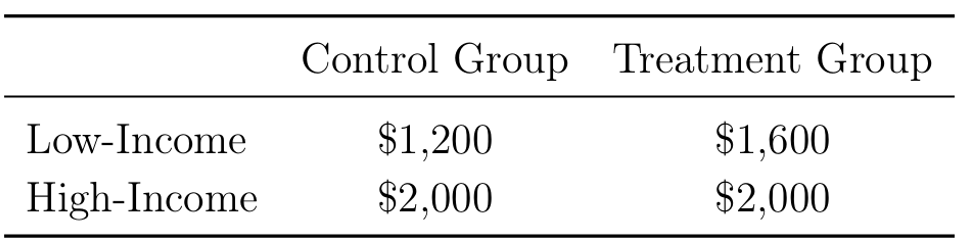

<link rel="stylesheet" href="styles.css" type="text/css">
<link rel="stylesheet" href="site_libs/academicons-1.9.1/css/academicons.min.css"/>

<br><br><br>

---
title: "Statistics using R"
---

<br><br><br>


<br>

<br><br><br>

## 1. Hypothesis Testing with Two-Sample Proportion Test


<br>

### 1. Figure

<p align="center">

</p>
<p align="center">
[Fig. Treatment Effects between New banner Ad and Old Banner Ad]
</p>


<br>

<br><br>

### 2. Goal

To test if the Click-Through-Rate (CTR) difference between Ad B (treatment group) and Ad A (Control group). 

<br>

### 3. Hypotheses

**Null Hypothesis (H₀):**
- The null hypothesis indicates Ad B is not effective than Ad A
- The null hypothesis indicates the CTR (Click through Rate) of Ad B is less than or equal to the CTR (Click through Rate) of Ad A
$$
H_0: p_B \leq p_A
$$

**Alternative Hypothesis (H₁):**
- The null hypothesis indicates Ad B is more effective than Ad A
- The null hypothesis indicates the CTR (Click through Rate) of Ad B is more than the CTR of Ad A 
$$
H_1: p_B > p_A
$$

<br>

### 4. Methodology & Summary

  + Two Sample proportion z-test was used: 
     + Ad A and Ad B each had 500 samples.
     + Success = clicking the ad (CTR).
     + CTR of Ad A = 3% CTR and Ad B = 5.6% CTR. 
     + Result: p-value = 0.0307 rejecting the null hypothesis.
     
  + Conclusion: At a 0.05 significance level, the p-value of 0.0307 indicates that the null hypothesis (Ad B is not more effective than Ad A) can be rejected. The p-value represents the probability of observing a result as extreme as, or more extreme than, the current outcome under the assumption that the null hypothesis is true. Since the p-value is less than the significance level, we have sufficient evidence to reject the null hypothesis, suggesting that Ad B is statistically significantly more effective than Ad A.


<br>

### 5. Code

```{r}
#Q1
### Set seed to ensure we consistently generate the same results
set.seed(1)

### Create two random samples of A and B with sample size 500 respectively 
### A and B are distributed binomial with sample means 0.03 and 0.05
### A and B follow binomial distributions while indicating 1 is success (clicking the Ad) and 0 is failure (not clicking the Ad)
nbin <- 500
A <- data.frame(CTR = rbinom(n = nbin, prob = 0.03, size = 1))
B <- data.frame(CTR = rbinom(n = nbin, prob = 0.05, size = 1))

### Sample counts, counting the success of clicking the Ad.
countA <- sum(A$CTR)
countB <- sum(B$CTR)

### Two-sample proportions z-test with one-sided test 
prop.test(x = c(countB, countA), 
          n = c(nbin, nbin), 
          alternative = "greater")

# Ad B is clicked 5% otherwise Ad A is clicked 3% on the time but this is very unlikely (only 3% based on the p-value) that 
# this outcome can be gained under the assumption that the null hypothesis is true. Therefore, we suspect that the null hypothesis is not true.
```

<br>

<br><br><br>

## 2. Hypothesis Testing with 10,000 Random Samples 


<br>


<br><br><br>

### 1. Figure

<p align="center">

</p>
<p align="center">
[Fig. Treatment Effects between New banner Ad and Old Banner Ad]
</p>


<br>

<br><br>

### 2. Goal
To test if the mean Click-Through-Rate (CTR) between Ad A and Ad B is greater than 2.6%.

<br>

### 3. Hypotheses

**Null Hypothesis (H₀):**

The mean difference in CTR between Ad B and Ad A is **less than or equal to 2.6%**:

$$
H_0: \mu_B - \mu_A \leq 0.026
$$

**Alternative Hypothesis (H₁):**

The mean difference in CTR between Ad B and Ad A is **greater than 2.6%**:

$$
H_1: \mu_B - \mu_A > 0.026
$$

<br>

### 4. Methodology & Summary

  + Two Sample proportion z-test was used: 
     + 10,000 random samples of size 500 were drawn for both Ad A and Ad B, assuming both had a mean CTR of 4.3%, which indicates that those samples are simulated under the assumption that the null hypothesis is true as the mean of each distribution is the same as each other. 
     + The mean CTR difference was calculated.
     + If the mean difference exceeded 2.6%, the null hypothesis was rejected. 
     + Result: p-value = 0.0242 rejecting the null hypothesis.
     
  + Conclusion: At a 0.05 significance level, the p-value of 0.0242 indicates that the null hypothesis (The mean difference between the two Ads is less than or equal to 2.6%.) can be rejected. The p-value represents the probability of observing a difference as extreme as, or more extreme than, 2.6% under the assumption that the null hypothesis is true. The probability of observing this extreme value (the mean difference between the two Ads greater than 2.6%) is 2.4%. Since the p-value is less than the significance level, we have sufficient evidence to reject the null hypothesis, suggesting that Ad B is statistically significantly 2.6% more effective than Ad A.


<br>

### 5. Code

```{r}
### 10,000 random samples from binomial with mean 0.043, for both Ad A and AD B which fits the null hypothesis with Ad B not being more effective than Ad A
### 4.3% indicates the average CTR of A and B 
### The purpose for this sampling is to identify whether CTR for Ad B is 2.6% larger than Ad A even if we got random samples for binomial distribution with the same average mean for both Ad A and Ad B. 

set.seed(1)
### Create data frame for mean of samples 
hypothesis <- data.frame(matrix(0, nrow = 10000, ncol = 4))

### Name columns 
colnames(hypothesis) <- c('A', 'B', 'Dif', 'RejectH0')

for (x in 1:10000) {
  # The sample mean is the same as 4.3% (CTR = 4.3%)
  hypothesis$A[x] <- mean(rbinom(n = nbin, prob = 0.043, size = 1))
  hypothesis$B[x] <- mean(rbinom(n = nbin, prob = 0.043, size = 1))
  
  # The difference in CTR between A and B
  hypothesis$Dif[x] <- hypothesis$B[x] - hypothesis$A[x]
  
  # If the CTR of B is greater than 2.6% than A, we reject the null hypothesis.
  hypothesis$RejectH0[x] <- ifelse(hypothesis$B[x] - hypothesis$A[x] > 0.026, 1, 0)
}

# The summary table of the result for this hypothesis testing.
summary(hypothesis$RejectH0)
```

<br>

<br><br><br>

## 3. Random Sampling


<br>


<br><br><br>

### 1. Figure

<p align="center">

</p>
<p align="center">
[Fig. How Sample Mean Evolves as Sample Size Increases]
</p>


<br>

<br><br>

### 2. Goal

  + To demonstrate how the sample mean evolves as the sample size increases, and how the population variance affects the variability of sample means. 
     + The sample mean becomes closer to the true population mean as the sample size increases. 
     + The stability of sample means improves when sampling from populations with lower variance. 
     
<br>

### 3. Methodology

  1. Setup:
     + Two populations are sampled, both with a mean of 70 but with different variances. 
       + Population 1: Variance = 36 (Standard Deviation = 6)
       + Population 2: Variance = 9 (Standard Deviation = 3)
     + Sample sizes range from 1 to 100.  
   
  2. Process:
     + Random samples are drawn from each population for each sample size (1 to 100).
     + The sample means are calculated and stored for both populations.     
  
  3. Process:
     + The sample means are plotted against sample sizes to observe trends.
     + Red Line: Population with larger variance (36)
     + Blue Line: Population with smaller variance (9)
   
  4. Conclusion:
     + When the population variance is larger and sampling from this population, the sample means vary largely when the sample size is smaller. This variance is getting smaller when the sample size increases. In contrast, if the population variance is smaller and random samples from this population, there is less variability in the sample means compared to the first random sampling from the population with larger variance. The sample mean of the second population gets closer to the population mean which is 70 rapidly while showing greater stability even when the sample size is small. 
     

<br>

### 4. Code

```{r}
### Set seed to ensure we consistently generate the same results 
set.seed(1)

### Create data frame to store the means of the samples
sample_example <- data.frame(matrix(0, nrow = 100, ncol = 3))

### Name columns
colnames(sample_example) <- c('ssize', 'mean1', 'mean2')

# Create random samples from a normal distribution with mean = 70 but with different variance
# Sample sizes range from 1 to 100

for (x in 1:100) {
  # Generate random samples for two sets from the normal distribution with the same mean 70 and different variances. The first sample has 70 as mean and 36 as variance. The second sample has 70 as mean and 9 as variance. 
  sample_run1 <- data.frame(sample = rnorm(x, 70, 36))
  sample_run2 <- data.frame(sample = rnorm(x, 70, 9))
  
  # Store the sample size
  sample_example$ssize[x] <- x
  
  # Calculate the means of the samples and store them 
  sample_example$mean1[x] <- mean(sample_run1$sample)
  sample_example$mean2[x] <- mean(sample_run2$sample)
}

# View the results
head(sample_example)

# When the sample size is the same in each row, if the standard deviation is smaller, we could get more stable sample means closer to the population mean 70.
```
```{r}
### Plot X=Sample Size, Y = mean
library(ggplot2)
ggplot() + 
  geom_line(data=sample_example, aes(x=ssize,y=mean1), color="red")+ 
  geom_line(data=sample_example, aes(x=ssize,y=mean2), color="blue")+ 
  ggtitle("How sample mean evolves as sample size increases") +
  theme(plot.title = element_text(hjust = 0.5)) +
  labs(x='Sample Size',y='Sample Mean')
```
<br>

<br><br><br>

## 4. Multi-Armed Bandit


<br>


<br><br><br>

### 1. Definition 

  + The Multi-Armed Bandit approach tests multiple levers (e.g., advertisements) to identify the best lever offering the highest compensation. In this case: 
     + 4 advertisements are tested to determine the one with the highest CTR (Click-Through Rate).
     + Fisher's exact test is used instead of the proportion test when sample sizes (exposures of advertisements) are low. 
     

<br>

<br><br>

### 2. Goal
To identify the advertisement with the highest CTR and evaluate whether any other advertisements can serve as suitable alternatives. 
     
<br>

### 3. Methodology

  1. Setup:
     + Four advertisements (Ad1, Ad2, Ad3, Ad4) are initialized with baseline CTRs:
       + Ad1: 2.5%, Ad2: 1%, Ad3: 0.5%, Ad4: 1.5%.
     + The best advertisement starts with the highest baseline CTR.
   
  2. Dynamic Sampling:
     + Advertisements are exposed probabilistically, with higher probabilities assigned to the current best-performing ad.
     + A random click (1 for success, 0 for failure) is generated based on the CTR of the selected ad.   
  
  3. Updating Beliefs:
     + Clicks and exposures are updated after each trial.
     + CTR for each advertisement is recalculated:
       - **CTR** (Click-Through Rate):  

$$
\text{CTR} = \frac{\text{Clicks}}{\text{Exposures}}
$$
     + CTR represents the ratio of the number of clicks to the number of times an advertisement was shown (exposures).
              
  4. Testing Significance: 
     + Once all advertisements have at least 10 exposures, Fisher's test is applied:
     + **Null Hypothesis (\(H_0\)):**  

     $$
H_0: \text{CTR}_{\text{Best}} \geq \text{CTR}_{\text{Alternative}}
     $$
     + **Alternative Hypothesis (\(H_1\)):**  
    
     $$
H_1: \text{CTR}_{\text{Best}} < \text{CTR}_{\text{Alternative}}
     $$
     + Advertisements with p-values < 0.05 are removed due to significant differences from the best ad.   
   
  5. Conclusion:
     + The process continues until only the best advertisement and its close alternatives (if any) remain. 
     + The first advertisement has the highest CTR and there are no suitable alternatives with similar CTR compared to the best choice. 
     

<br>

### 4. Code

```{r}
# Choose 4 advertisements 
N_ARMS = 4
# Identifier for each advertisement 
ARMS = c(1,2,3,4)
# Set the baseline CTR for each advertisement 
base_rates = c(.025,.01,.005,.015)
# Before the experiment, the first advertisement has the highest CTR
best = 1
# Initialize the number of clicks, the number of advertisement exposure, and CTR (the number of clicks / the total number of advertisement exposure)
clicks <-c(0,0,0,0)
draws <-c(0,0,0,0)
CTR <-c(0,0,0,0)

options(warn=-1)

set.seed(1)

while(N_ARMS>1){
  # Generate a random draw of ad from proportion .5 best, else other)
  # Set arm probabilities
  # Except for the best advertisement, 0.5 probabilities divided by remaining advertisements
  epsilon = .5/(N_ARMS-1)
  chosen_arm_p = c(0,0,0,0)
  for (i in 1:length(ARMS)) {
    chosen_arm_p[ARMS[i]]=epsilon
  }
  # Assign 0.5 exposure probability for the best advertisement
  chosen_arm_p[best]=.5
  # Choose the probability as the threshold to pull the arm
  choicep <- runif(1, min = 0, max = 1)
  choice=0
  # Choose the advertisement when the choice probability generated by uniform distribution is included in the cumulative range for each advertisement
  # If one of the advertisements is selected, choice == 0 is not satisfied and the for loop is ended. 
  for (i in 1:length(ARMS)) {
    if (choicep<=sum(chosen_arm_p[1:ARMS[i]]) & choice==0){choice=ARMS[i]}
  }
  # Generate click or not click using CTR for each advertisement set above
  # click has 1 (click) or 0 (not click) for one exposure 
  click <- rbinom(n=1,prob=base_rates[choice],size=1)
  # Update beliefs about frequency
  # Accumulate the number of clicks for each advertisement 
  clicks[choice] <- clicks[choice]+click
  # The number of exposure increments by 1 for every trial 
  draws[choice] <- draws[choice]+1
  # If the exposure is 0, the value is returned as 0 whereas CTR is calculated as clicks[choice] / draws [choice]
  CTR[choice] = ifelse(draws[choice]==0, 0, (clicks[choice]/draws[choice]))
  # Re-assign best 
  best=0
  # CTR object stores the CTR for each advertisement and find the best advertisement with the max CTR value
  for (i in 1:length(ARMS)) {
    if (CTR[ARMS[i]]==max(CTR) & best==0){best=ARMS[i]}
  }
  # Test for significant difference between the best advertisement and the rest of the options
  # Remove all for which p-value <0.05, indicating that there is significant difference between the best and other option
  # Only remove once each alternative has been drawn at least ten times 
  # prop.test inappropriate and gives error if samples are too small
  # The minimum exposure for each advertisement is greater than 10
  if (min(draws)>10) {
  keep = c()
  for (i in 1:length(ARMS)) {
    if (ARMS[i]!=best) {
      # The null hypothesis for the prop.test is CTR(best) is greater or than or equal to CTR(alternative) and the alternative hypothesis is CTR(best) is less than CTR(alternative). 
      # If the null hypothesis is rejected, that alternative should be removed because there is statistically significant difference between the two. However, in this example. prop.test cannot be used due to lower exposure. Chi-squared test may not be appropriate when numerator is zero or very low.
      # Fisher's test should be used 
    result<-fresult <- fisher.test(
  matrix(
    c(clicks[best], clicks[ARMS[i]], 
      draws[best] - clicks[best], draws[ARMS[i]] - clicks[ARMS[i]]),
    nrow = 2
  ),
  alternative = "greater"
)
    if (result$p.value>.05) {keep=c(keep,ARMS[i])}
    }
    if (ARMS[i]==best) {keep = c(keep,best)}
  }
  N_ARMS = length(keep)
  ARMS=keep
  }
}

ARMS  
```


```{r}
rbind(base_rates, CTR)
```

```{r}
draws
```

<br>

<br><br><br>

## 5. Instagram Ads A/B Testing (Disney)


<br>


<br><br><br>

### 1. Figure

<p align="center">

</p>
<p align="center">
[Fig. Decide whether to continue on the Ad based on Incremental Conversion Rate]
</p>
     

<br>

<br><br>

### 2. Goal
To identify whether any treatment effect represented by Incremental Conversion Rate (ICR) is positive.
     
<br>

### 3. Hypotheses and Formula of ICR
+ The **Incremental Conversion Rate (ICR)** is defined as:
   - **ICR** (Incremental Conversion Rate):  

   $$
   \text{ICR} = \text{Conversion_Rate(Treatment)} - \text{Conversion_Rate(Control)}
   $$

+ **Treatment group**: Exposed to the advertisement.  
+ **Control group**: Not exposed to the advertisement.

+ **Null Hypothesis (\(H_0\)):**

   $$
   H_0: \text{ICR} \leq 0 \quad \text{(The incremental conversion rate is less than or equal to 0)}.
   $$

+ **Alternative Hypothesis (\(H_1\)):**

   $$
   H_1: \text{ICR} > 0 \quad \text{(The incremental conversion rate is greater than 0)}.
   $$


### 4. Conclusion:
+ The p-value obtained from this test allow us to reject the null hypothesis. This indicates that the conversion rate in the treatment group is statistically significantly greater than that in the control group.   


<br>

### 5. Code

```{r}
# Load the RData file
load("DisneyAB.Rdata") 
### tests
### Proportion test for ICR
# Sample is 10,000 people for treatment group and control group 
sample=10000
# 
prop.test(x=c(sum(DisneyAB$TreatConv),sum(DisneyAB$ControlConv)), n=c(sample,sample), alternative = "greater")
```

<br>

<br><br><br>

## 6. Instagram Ads ROI (Return On Investment) (Disney)


<br>


<br><br><br>

### 1. Figure

<p align="center">

</p>
<p align="center">
[Fig. Calculate ROI to decide whether to continue on the Advertisement.]
</p>
     

<br>

<br><br>

### 2. Goal
To identify whether the conversion revenue is different between converted treatment and control group. In addition, Return On Investment (ROI) is calculated to decide whether to continue on the advertisement. 
     
<br>

### 3. Hypotheses and Formula of ROI:
+ **Null Hypothesis (\(H_0\)):**  

   $$
   H_0: \mu_{\text{Treatment}} = \mu_{\text{Control}}
   $$

+ **Alternative Hypothesis (\(H_1\)):**  

   $$
   H_1: \mu_{\text{Treatment}} \neq \mu_{\text{Control}}
   $$

+ The **ROI** is calculated as follows: Sample 10,000 people for treatment and control group. Total cost of experiment is \( 10,000 \times 0.2 = 20 \).

   $$
   \text{ROI} = \frac{\text{Revenue}_{\text{Treatment}} - \text{Revenue}_{\text{Control}} - \text{Cost}}{\text{Cost}}
   $$


### 4. Conclusion:
+ At 0.05 significance level, the null hypothesis cannot be rejected, indicating there is no statistically significant difference in conversion revenue between the converted control and treatment group exposed to Disney advertisement. Consequently, the experiment does not provide sufficient evidence to conclude that the Disney advertisement has a significant impact on the average conversion revenue among converted users.

+ The Disney advertisement generates 305.95 times the return on investment compared to the cost of running the advertisement, relative to the control group.


<br>

### 5. Code

```{r}
### Subset the data
DisTRev <- subset(DisneyAB$TreatRev, DisneyAB$TreatConv == 1)
DisCRev <- subset(DisneyAB$ControlRev, DisneyAB$ControlConv == 1)

### Test Welch Two Sample t-test under the assumption that the variances between the two differ
t.test(DisTRev, DisCRev, alternative = "two.sided", var.equal = FALSE)
```

```{r}
### ROI Disney 
(sum(DisTRev)-sum(DisCRev)-20)/20
```

<br>

<br><br><br>

## 7. Instagram Ads A/B Testing (Alo)


<br>


<br><br><br>

### 1. Figure

<p align="center">

</p>
<p align="center">
[Fig. Decide whether to continue on the Ad based on Incremental Conversion Rate]
</p>
     

<br>

<br><br>

### 2. Goal
To identify whether any treatment effect represented by Incremental Conversion Rate (ICR) is positive.
     
<br>

### 3. Hypotheses and Formula of ICR

+ The **Incremental Conversion Rate (ICR)** is defined as:

   - **ICR** (Incremental Conversion Rate):  

     $$
     \text{ICR} = \text{Conversion\_Rate(Treatment)} - \text{Conversion\_Rate(Control)}
     $$

   - **Treatment group**: Exposed to the advertisement.  
   - **Control group**: Not exposed to the advertisement.

+ **Null Hypothesis (\(H_0\)):**  

   $$
   H_0: \text{ICR} \leq 0 \quad \text{(The incremental conversion rate is less than or equal to 0)}.
   $$

+ **Alternative Hypothesis (\(H_1\)):**  

   $$
   H_1: \text{ICR} > 0 \quad \text{(The incremental conversion rate is greater than 0)}.
   $$


### 4. Conclusion:
+ The p-value obtained from this test allow us to reject the null hypothesis. This indicates that the conversion rate in the treatment group is statistically significantly greater than that in the control group.   


<br>

### 5. Code

```{r}
load("AloAB.Rdata") 
### tests for another data
### Proportion test for ICR
### ICR = Conversion_Rate(Treatment) − Conversion_Rate(Control)
# Assign 10,000 units for both treatment and control groups 
sample=10000
prop.test(x=c(sum(AloAB$TreatConv),sum(AloAB$ControlConv)), n=c(sample,sample), alternative = "greater")
```


<br>

<br><br><br>

## 8. Instagram Ads ROI (Return On Investment) (Alo)


<br>


<br><br><br>

### 1. Figure

<p align="center">

</p>
<p align="center">
[Fig. Calculate ROI to decide whether to continue on the Advertisement]
</p>
     

<br>

<br><br>

### 2. Goal
To identify whether the conversion revenue is different between converted treatment and control group. In addition, Return On Investment (ROI) is calculated to decide whether to continue on the advertisement. 
     
<br>

### 3. Hypotheses and Formula of ROI:

+ **Null Hypothesis (\(H_0\)):**  

   $$
   H_0: \mu_{\text{Treatment}} = \mu_{\text{Control}}
   $$

+ **Alternative Hypothesis (\(H_1\)):**  

   $$
   H_1: \mu_{\text{Treatment}} \neq \mu_{\text{Control}}
   $$

+ The **ROI** is calculated as follows:  
   Sample 10,000 people for the treatment and control groups.  
   Total cost of the experiment is \( 10,000 \times 0.2 = \$20 \).

   $$
   \text{ROI} = \frac{\text{Revenue}_{\text{Treatment}} - \text{Revenue}_{\text{Control}} - \text{Cost}}{\text{Cost}}
   $$
 

### 4. Conclusion:
+ At 0.05 significance level, the null hypothesis cannot be rejected, indicating there is no statistically significant difference in conversion revenue between the converted control and treatment group exposed to Alo advertisement. Consequently, the experiment does not provide sufficient evidence to conclude that the Alo advertisement has a significant impact on the average conversion revenue among converted users. 

+ In case of ROI of the Alo advertisement, the treatment group exposed to the advertisement 0.3655 times the return on investment compared to the cost of running the advertisement, relative to the control group. This indicates that the Alo advertisement is less effective to generate more revenue from the treatment group compared to the control group. 


<br>

### 5. Code

```{r}
AloTRev <- subset(AloAB$TreatRev, AloAB$TreatConv == 1)
AloCRev <- subset(AloAB$ControlRev, AloAB$ControlConv == 1)
t.test(AloTRev, AloCRev, alternative = "two.sided", var.equal = FALSE)
```

```{r}
(sum(AloTRev)-sum(AloCRev)-20)/20
```

<br>

<br><br><br>

## 9. Hypothesis Testing with Multiple Treatments


<br>

<br><br><br>

### 1. Figure

<p align="center">

</p>
<p align="center">
[Fig. Do Nutrition Labels Encourage Healthier Eating?]
</p>
     

<br>

<br><br>

### 2. Objective
To determine if there is any difference in the average nutrition score of shopping baskets across different labeling treatments for an online grocer. The treatments include:
- **Star Nutrition Labels**
- **Letter Grade Nutrition Labels**
- **Warning Labels**
- **Control Group (No Labels)**

Dependent variable: Average nutrition score of the shopping basket.

<br>

### 3. Methodology

#### (a) Visualization
Using boxplots to compare the basket scores across treatments.

```{r}
getwd()
file_path <- "C:/Users/sjh50/OneDrive/문서/UC Davis/Paul/Github/Lecture2/Grocery.Rdata"
load("Grocery.Rdata")

library(DescTools)
library(ggplot2)
```

```{r}
summary(Grocery$BasketScore[Grocery$Condition=="Control"])
summary(Grocery$BasketScore[Grocery$Condition=="Star"])
summary(Grocery$BasketScore[Grocery$Condition=="Letter"])
summary(Grocery$BasketScore[Grocery$Condition=="Warn"])


### ggplot 
ggplot(Grocery, aes(x=Condition, y=BasketScore, fill=Condition)) + 
geom_boxplot()+
 theme(text = element_text(size = 20))
```

#### (b) ANOVA Test
To test for significant differences in means among treatments.

```{r}
### ANOVA test to identify whether there is significant difference in the mean among different treatments 
anova <-aov(BasketScore ~ Condition, data = Grocery)
summary(anova)
```

**Null Hypothesis (\(H_0\))**:
$$
H_0: \mu_{\text{Star}} = \mu_{\text{Letter}} = \mu_{\text{Warning}} = \mu_{\text{Control}}
$$

**Alternative Hypothesis (\(H_A\))**:
$$
H_A: \text{At least one group mean is different.}
$$

At 0.05 significance level, the null hypothesis can be rejected. It concludes that at least one treatment mean is different. In order to find which treatment differs, TukeyHSD is used for finding. 

#### (c) TukeyHSD Test
To identify which treatments differ.

```{r}
TukeyHSD(anova)
```
Interpretation: 
(1) Letter - Control: There is a statistically significant difference in basket score between Letter Nutrition Labels and no labels. If there are letter nutrition labels, it encourages customers to buy healthier groceries while increasing the basket scores by 3.18 units compared to the control group. 
(2) Star - Control: There is a statistically significant difference in basket score between Star Nutrition Labels and no labels (control). When Star Nutrition Labels are displayed, they encourage customers to buy healthier groceries, increasing the basket score by 2.18 units compared to the control group. 
(3) Warn - Control: There is a statistically significant difference in basket score between Warn Nutrition Labels and no labels. Warning Labels have the strongest effect, leading to a increase of 5.38 units in basket scores compared to the control group. 
(4) Warn - Letter: When comparing Warning Nutrition Labels and Letter Nutrition Labels, there is a statistically significant difference in basket scores. Warning Labels are more effective, increasing basket scores by 2.18 units compared to Letter Nutrition Labels.
(5) Warn - Star: When comparing Warning Nutrition Labels and Star Nutrition Labels, there is a statistically significant difference in basket scores. Warning Labels are more effective, increasing basket scores by 3.19 units compared to Star Nutrition Labels.
(6) Star - Letter: It is not statistically significant in basket scores between Star and Letter labels. 

#### (d) Regression Analysis

```{r}
### Regression
OLS <- lm(Grocery$BasketScore ~ Grocery$Condition)
summary(OLS)
```
At a 0.05 significance level, the overall model is statistically significant but R-squared is low. Only 2.3% of the variation in the dependent variable is explained by independent variables. 
In terms of coefficients of the independent variables, all coefficients are statistically significant at 0.05 significance level. The baseline Basket Score for the control group is 55.27 units, meaning that the average basket scores without labels is 55.27 units. In case of Warning Nutrition Labels, if there is one unit increase in the use of Warning Nutrition Labels, basket scores increase by 5.37 units on average.

<br>

### 4. Additional Analyses

#### (a) Dunnett's Test

Dunnett's Test is specifically designed to compare the control group with each of the treatment groups individually. 

```{r}
DunnettTest(x=Grocery$BasketScore, g=Grocery$Condition)
```
Interpretation:
All treatment groups increase the basket scores compared to the control group which means that all of them are effective to encourage people to buy healthier food. In case of Warning Nutrition Labels, it is the most effective labeling method compared to the other options by increasing 5.37 units of the basket scores. 

#### (b) Binary Analysis: Warning vs. Others

```{r}
# Make Warning Nutrition Labels as 1 and the other labels (Control, Letter, Star) as 0
Grocery$Warning <- 0
Grocery$Warning[Grocery$Condition == "Warn"] <- 1
```

```{r}
OLS2 <- lm(Grocery$BasketScore ~ Grocery$Warning)
summary(OLS2)
```
When there are not Warning Nutrition Labels, the average basket score is 57.06. If there is Warning Nutrition Labels, it increases the basket scores by 3.58 units. At 0.05 significance level, the coefficient of Warning Labels is statistically significant. The overall model is valid due to the p-value less than 0.05 significance level. 


Compare the mean difference between Warning Nutrition Labels and the other label options to identify any significant mean difference in Waring Nutrition Labels in the basket scores compared with the other options.

**Null Hypothesis (\(H_0\))**:
$$
H_0: \mu_{\text{Warning}} \leq \mu_{\text{Other}}
$$

**Alternative Hypothesis (\(H_A\))**:
$$
H_A: \mu_{\text{Warning}} > \mu_{\text{Other}}
$$
```{r}
t.test(Grocery$BasketScore[Grocery$Warning==1], Grocery$BasketScore[Grocery$Warning==0], alternative = "greater", var.equal = FALSE)
```
At 0.05 significance level, the null hypothesis can be rejected. There is a statistically significant mean difference in the basket scores between Warning Nutrition Labels and other Label options and the mean basket scores of Warning Nutrition Labels is greater than the other labels. 


### 5. Pairwise Comparisons

#### (a) Warning vs. Nutrition (Star + Letter)

```{r}
# Combine Letter and Star as Nutrition
Grocery$Condition2 <- Grocery$Condition
Grocery$Condition2[Grocery$Condition == "Letter" | Grocery$Condition == "Star"] <- "Nutrition"

t.test(Grocery$BasketScore[Grocery$Condition2 == "Warn"], 
       Grocery$BasketScore[Grocery$Condition2 == "Nutrition"], 
       alternative = "greater", 
       var.equal = FALSE)
```

**Null Hypothesis (\(H_0\))**:
$$
H_0: \mu_{\text{Warn}} \leq \mu_{\text{Nutrition}}
$$

**Alternative Hypothesis (\(H_A\))**:
$$
H_A: \mu_{\text{Warn}} > \mu_{\text{Nutrition}}
$$
At 0.05 significance level, the null hypothesis can be rejected. The mean basket scores of Warning Nutrition Labels are greater than the mean basket scores of combined Nutrition (Star and Letter) Labels. 

#### (b) Nutrition (Star + Letter) vs. Control

```{r}
t.test(Grocery$BasketScore[Grocery$Condition2=="Nutrition"], 
       Grocery$BasketScore[Grocery$Condition2=="Control"], 
       alternative = "greater", 
       var.equal = FALSE)
```

**Null Hypothesis (\(H_0\))**:
$$
H_0: \mu_{\text{Nutrition}} \leq \mu_{\text{Control}}
$$

**Alternative Hypothesis (\(H_A\))**:
$$
H_A: \mu_{\text{Nutrition}} > \mu_{\text{Control}}
$$
At 0.05 significance level, there is a statistically significant difference in the basket scores between Nutrition labels (Star and Letter) and Control groups. The null hypothesis can be rejected and the mean basket scores of Nutrition labels (Star and Letter) is greater than the mean basket scores of control groups. 

<br>

### 6. Conclusion

- Warning Labels are the most effective treatment, significantly increasing basket scores compared to all other treatments and the Control group.
- Nutrition Labels (Star + Letter) are also effective but less impactful than Warning Labels.
- Future recommendations could focus on optimizing the design and implementation of Warning Labels to maximize their impact on healthier grocery choices.


<br>

<br><br><br>

## 10. Parametric and Non-parametric Regression Analysis 


<br>

<br><br><br>

### 1. Figure

<p align="center">

</p>
<p align="center">
[Fig. To Determine whether a Parametric or Non-parametric fit well with the data.]
</p>
     

<br>

<br><br>

### 2. Objective
To analyze the relationship between **Price** and **Unit Sales** using various regression approaches, including linear, non-linear, and non-parametric models.

<br>

### 2. Methodology

#### (a) Data Preparation

```{r}
load("Prices.Rdata")
```

#### (b) Visualizations

##### (i) Boxplot of Unit Sales by Price (Categorical)

```{r}
### Make a factor variable of prices to convert a continous variable into a categorical variable 
prices$PriceFactor <- as.factor(prices$Price)
### Figures using price as a factor
ggplot(prices, aes(x=PriceFactor, y=UnitSales)) + 
 geom_boxplot()
```

##### (ii) Scatterplot of Unit Sales vs. Price (Continuous)

Linear Trend:
```{r}
ggplot(prices, aes(x=Price, y=UnitSales)) + 
 geom_point() +
 geom_smooth(method=lm)
```
Non-linear Trend (Loess):
```{r}
ggplot(prices, aes(x=Price, y=UnitSales)) + 
 geom_point() +
 geom_smooth(method = "loess")
```

<br>

#### (c) Regression Models

##### (i) Linear Regression (Price as Continuous)

```{r}
### Simple Regression Models
 OLS1 <- lm(prices$UnitSales ~ prices$Price)
 summary(OLS1)
```
Interpretation: The above linear relationship while treating Price as a continuous variable. The Price coefficient is statistically significant at 0.05 significance level. When the Price increases by 1 unit, the Unit sales decreases by 557.408 units. 

##### (ii) Linear Regression (Price as Categorical)

```{r}
OLS2 <- lm(prices$UnitSales ~ prices$PriceFactor)
summary(OLS2)
```
Interpretation: Compared to the linear regression model with the same coefficient slope making the linearly decreasing regression model, when making Price variable as a categorical variable, the coefficient variables vary depending on different price factors, indicating the relationship between Unit sales and Price factors is non-linear. 

##### (iii) Polynomial Regression

```{r}
# Add higher-order terms for polynomial regression
prices$PriceSq <- prices$Price^2
prices$PriceCu <- prices$Price^3

OLS3 <- lm(prices$UnitSales ~ prices$Price + prices$PriceSq + prices$PriceCu)
summary(OLS3)
```

##### (iv) Log-Linear Regression

```{r}
prices$LnPrice <- log(prices$Price)
OLS4 <- lm(prices$UnitSales ~ prices$LnPrice)
summary(OLS4)
```

##### (v) Exponential Regression

```{r}
prices$ExpPrice <- exp(prices$Price)
OLS5 <- lm(prices$UnitSales ~ prices$ExpPrice)
summary(OLS5)
```

### 3. Results Comparison

- **Polynomial Regression (OLS3)**: Captures non-linear patterns with significant coefficients for higher-order terms.
- **Log-Linear Regression (OLS4)**: Provides a logarithmic fit, indicating percentage changes in Unit Sales relative to Price changes.
- **Exponential Regression (OLS5)**: Models rapid increases or decreases in Unit Sales.
- **Non-Parametric (Price as Categorical)**: Achieves the highest Adjusted R-squared value (0.7791) and the lowest residual standard error. However, non-parametric models have limited scalability outside experimental price points.


### 4. Conclusion
Among the models, treating Price as a categorical variable yielded the best fit (highest Adjusted R-squared). However, for prediction purposes, polynomial and log-linear regressions are more scalable and practical for prices beyond the experimental range.

<br>

<br><br><br>

## 11. Savings Analysis 


<br>

### 1. Objective
To analyze the impact of treatment on deposit amounts across different income groups and age categories using t-tests and regression models. The analysis also explores conditional average treatment effects (CATEs) to identify individual-level treatment heterogeneity.

<br>

### 2. Methodology

#### (a) Visualizations

##### (i) Deposits by Age and Treatment Group

```{r}
load("Savings.Rdata")
```

```{r}
ggplot(Savings, aes(x=Age, y=Deposits, color=TreatGroup)) + 
  geom_point() +
  geom_smooth(method=lm, aes(group=TreatGroup))
```
##### (ii) Deposits by Income and Treatment Group

```{r}
ggplot(Savings, aes(x=Income, y=Deposits, color=TreatGroup)) + 
  geom_point() +
  geom_smooth(method=lm, aes(group=TreatGroup))
```

#### (b) Group Comparisons Using t-tests

##### (i) Create Income Groups and Age Dummies

**Null Hypothesis (\(H_0\))**:

$$
H_0: \mu_{\text{Treatment}} \leq \mu_{\text{Control}}
$$

**Alternative Hypothesis (\(H_A\))**:

$$
H_A: \mu_{\text{Treatment}} > \mu_{\text{Control}}
$$

```{r}
### t-tests by group
### Income group and age dummies
Savings$Age35 <- ifelse(Savings$Age>=35, 1, 0)
Savings$IncGrp <- "<$50K"
Savings$IncGrp <- ifelse(Savings$Income>=50000, "$50-100K", Savings$IncGrp)
Savings$IncGrp <- ifelse(Savings$Income>100000, ">$100K", Savings$IncGrp)

### t-tests
INC1t <- subset(Savings$Deposits, Savings$TreatGroup == 1 &     Savings$IncGrp=="<$50K")

INC1c <- subset(Savings$Deposits, Savings$TreatGroup == 0 &  Savings$IncGrp=="<$50K")

INC2t <- subset(Savings$Deposits, Savings$TreatGroup == 1 & Savings$IncGrp=="$50-100K")

INC2c <- subset(Savings$Deposits, Savings$TreatGroup == 0 & Savings$IncGrp=="$50-100K")

INC3t <- subset(Savings$Deposits, Savings$TreatGroup == 1 & Savings$IncGrp==">$100K")

INC3c <- subset(Savings$Deposits, Savings$TreatGroup == 0 & Savings$IncGrp==">$100K")

INCt <- subset(Savings$Deposits, Savings$TreatGroup == 1)
INCc <- subset(Savings$Deposits, Savings$TreatGroup == 0)

### Entire population
t.test(INCt, INCc, alternative = "greater", var.equal = FALSE)
```

Compare the deposit amounts between control group and treatment group to identify if there is any difference in mean deposit amounts between the two groups. At 0.05 significance level, the null hypothesis can be rejected and the mean deposit amount of the treatment group is greater than the mean deposit amount of the control group. 

##### (ii) Perform t-tests for Each Income Group

**Null Hypothesis (\(H_0\))**:
$$
H_0: \mu_{\text{Treatment, Income Group 1}} \leq \mu_{\text{Control, Income Group 1}}
$$

**Alternative Hypothesis (\(H_A\))**:
$$
H_A: \mu_{\text{Treatment, Income Group 1}} > \mu_{\text{Control, Income Group 1}}
$$
```{r}
### Income group 1 (<$50K)
t.test(INC1t, INC1c, alternative = "greater", var.equal = FALSE)
```
In the income group 1 (<$50K), the null hypothesis can be rejected at 0.05 significance level, the mean deposit amount of the treatment group in the income group 1 is greater than the mean deposit amount of the control group in the income group 1. 

**Null Hypothesis (\(H_0\))**:
$$
H_0: \mu_{\text{Treatment, Income Group 2}} \leq \mu_{\text{Control, Income Group 2}}
$$

**Alternative Hypothesis (\(H_A\))**:
$$
H_A: \mu_{\text{Treatment, Income Group 2}} > \mu_{\text{Control, Income Group 2}}
$$
```{r}
### Income group 2 ($50-100K)
t.test(INC2t, INC2c, alternative = "greater", var.equal = FALSE)
```
In the income group 2 ($50K-$100K), the null hypothesis can be rejected at 0.05 significance level, the mean deposit amount of the treatment group in the income group 2 is greater than the mean deposit amount of the control group in the income group 2. 

**Null Hypothesis (\(H_0\))**:
$$
H_0: \mu_{\text{Treatment, Income Group 3}} \leq \mu_{\text{Control, Income Group 3}}
$$
**Alternative Hypothesis (\(H_A\))**:

$$
H_A: \mu_{\text{Treatment, Income Group 3}} > \mu_{\text{Control, Income Group 3}}
$$
```{r}
### Income group 3 (>$100K)
t.test(INC3t, INC3c, alternative = "greater", var.equal = FALSE)
```
In the income group 3 (>$100K), the null hypothesis can be rejected at 0.05 significance level, the mean deposit amount of the treatment group in the income group 3 is greater than the mean deposit amount of the control group in the income group 3. 

<br>

### 3. Regression Analysis

#### (a) Model 1: Income Group Treatment Effects

```{r}
### A regression approach
### Create Variables
Savings$INC1<- ifelse(Savings$IncGrp=="<$50K",1,0)
Savings$INC2 <- ifelse(Savings$IncGrp=="$50-100K",1,0)
Savings$INC3 <- ifelse(Savings$IncGrp==">$100K",1,0)
Savings$TreatInc1 <- Savings$TreatGroup * Savings$INC1
Savings$TreatInc2 <- Savings$TreatGroup * Savings$INC2
Savings$TreatInc3 <- Savings$TreatGroup * Savings$INC3
### First Model
OLS<-lm(Savings$Deposits ~ Savings$TreatInc1 + Savings$TreatInc2 + Savings$TreatInc3 + Savings$INC1 + Savings$INC2 + Savings$INC3)
summary(OLS)
```
**Interpretation**:
- The intercept represents deposits for the control group in Income Group 3 (>$100K): 2064.56 units.
- **Treatment Effects**:
  - Income Group 1: +546.43 units (statistically significant).
  - Income Group 2: +587.95 units (statistically significant).
  - Income Group 3: +150.84 units (not statistically significant).
- Income groups except for Income group 3 has the lower savings amount compared to the Income group 3.
- The treatment is the difference in the savings amount between the control group and the treatment group for each income group. 

#### (b) Model 2: Interaction of Treatment and Income Groups

```{r}
OLS <- lm(Savings$Deposits ~ Savings$TreatGroup * Savings$IncGrp)
summary(OLS)
```
**Interpretation**: In the first regression model, it represents the treatment effect for each income group. The first regression shows different income levels affect the amount of deposits without any treatment effect. However, the most important thing to discuss is that it represents the treatment effect for each income group. Therefore, this regression model shows the treatment effect for each income level comparing with the control group for each income group. In contrast, the second regression model shows the baseline treatment effect of the income group 2 ($50-100K) which allows us to compare the treatment effect among different income levels. First, the income group 2 received the treatment effect increases deposit amounts by 587.95 units on average when comparing the income group 2 within the control group. The income group 1 received the treatment effect saved 41.52 units less than the income group 2 received the treatment effect. However, this estimate is not statistically significant, meaning that this difference is not a meaningful difference but just random variation. However, the income group 3 in the treatment effect saved 437.46 units less than the income 2 group under the treatment effect and this estimate is statistically significant,concluding that the treatment effect differs between these groups. 

#### (c) Model 3: Including Age Interactions

```{r}
### Third Model, with Age
OLS<-lm(Savings$Deposits ~ Savings$TreatGroup*Savings$IncGrp + Savings$TreatGroup*Savings$Age35)
summary(OLS)
```
**Interpretation**: Here in this regression model, Age and income are covariates to estimate CATEs (Conditional Average Treatment effects) which can estimate an individual's heterogeneous treatment effect. Age is a categorical variable with two different value, one of which is younger than 35 (<35) and the other one is older than or equal to 35 (>=35). Intercept 803.44 units represents people's average saving amounts in the control group under 35 (<35) within the income group 2 ($50-100K). The treatment group effect is 352.64 units, indicating that people received treatment effect who are younger than 35 within the income group 2 saved more deposits (treatment effect) on average compared to the control group. We can answer the following questions by combining the effects of covariates such as age and income and their corresponding interaction terms with the treatment group and calculate CATE (Conditional Average Treatment Effect).

(1) What would the treatment effect be for some of age 30 with income of $40K?
The treatment effect is 38.99 units less than the control group with the same age and within the same income group , which is people younger than 30 within the income group 1 in the control group, which is 803.44 - 206.15 =  597.29 units. In conclusion, the treatment effect is 558.30 units.
(2) What would the treatment effect be for some of age 30 with income of $75K?
The treatment effect is 325.64 units greater than the control group with the same age and within the same income group, which is people younger than 30 within income group2 in the control group, which is 803.44. In conclusion, the treatment effect is 1129.08 units. 

#### (d) Model 4: Continuous Income and Age

```{r}
### Fourth model, with continuous interactions
# Appropriate if the treatment effect relationship is linear
OLS<-lm(Savings$Deposits ~ Savings$TreatGroup*Savings$Income + Savings$TreatGroup*Savings$Age)
summary(OLS)
```

**Interpretation**: In this regression model, covariates such as income and age are both treated an continuous. In case of the intercept, it represents people in the control group when their age and income are both zero saved -1026 units on average but it is not realistic because in the real world, age and income cannot be zero. When people in the control group with their age and income being zero are treated, their savings increases by 367 units on average. When income increases by 1 unit in the control group, the savings increases by 0.007807 units on average. Similarly, if age increases by 1 unit, the savings increases by 48.47 units on average. When income increases by 1 unit , the treatment effect decreases by 0.004383 units on average whereas when age increases by 1 unit, the treatment effect increases by 8.963 units on average.


### 4. Conclusion
- The first model focuses on treatment effects for each income group, showing significant increases in deposits for Income Groups 1 and 2.
- The second model emphasizes comparisons between groups, revealing significant differences between Income Groups 3 and 2 under treatment.
- The inclusion of age in the third and fourth models highlights the role of individual-level covariates in explaining treatment heterogeneity.
- Continuous interaction models provide nuanced insights but require careful interpretation due to extrapolation limitations.


<br>

<br><br><br>

## Theoretical Statistics Learning 

This document contains structured explanations and analyses of statistical concepts, experiments, and methods to support theoretical understanding and practical applications.

<br>

### 1. Experiments

<br>

#### (1) Why do we randomly assign people to a treatment and control group in an experiment?

- **Explanation**: If we want to compare two groups to determine any treatment effect on the dependent variable Y, we have to control other factors (confounders) except for the treatment effect to make the two groups identical. For example, if we want to experiment whether a specific treatment effect is effective by identifying any difference on the dependent variable, we have to control other factors and impose the treatment on a treatment group and compare the dependent variable of Y for each group to determine whether this treatment effect makes any difference on Y.   

<br>

#### (2) What is external validity, and why can it be low for lab experiments in a business setting?

- **Explanation**: External validity is the extent to which any findings in experiments can be extrapolated to other settings outside a laboratory. However, lab experiments in a business setting have low external validity as real-world environments are useful to observe real customers’ behaviors which affected by diverse factors that cannot be identically reflected in the lab experiments. Therefore, results from the lab experiments cannot be extrapolated into real scenarios accurately. In contrast, lab experiments in medical settings can be more extrapolated well in other settings outside the laboratory as medication effects are mostly related to biological mechanism in body, which is almost similar to human beings.  

<br>

#### (3) Why do field experiments tend to have higher external validity than laboratory experiments in a business setting? 

- **Explanation**: In a laboratory experiment, the primary limitation is that the experiment cannot perfectly reflect a real-scenario in which customers behave, which prevents external validity because there is high possibility that customers behave differently in the real-scenario. For example, in the laboratory experiment, customers prefer to purchase products with lower prices compared to field experiments where customers prefer to purchase high-quality products with higher prices. In a field experiment, we can monitor how customers behave in a real environment which would be maintained when applying learnings from this experiment and this identical environment can lead to similar results we have already obtained in the experiment.  

<br>

#### (4) When it comes to measuring important quantities like price elasticity, research has compared how field experiments perform relative to using statistical models on observational (non-experimental) data. What has the research found, and what likely explain this finding? 

- **Explanation**: When examining price elasticity in a field experiment, researcher can control other factors except for price to see the true relationship between price and demand. The researcher controls the quality of products, which could affect demand and set different prices in different locations to identify the price effect on the demand. However, in case of an observational data, researchers use the dataset already gathered in which other factors (confounders), affecting the price cannot be controlled. However, price effect can be endogenous, meaning that other factors such as quality can affect the price and demand, which prevents researchers from identifying the true price effect on the demand. For example, even if the real effect of the price on the demand is that higher price leads to lower demand, the quality of product typically increase prices, which also makes the demand higher. However, the observational data cannot remove this confounding factor, which confounds the true price effect on the demand. 

<br>

#### (5) In the context of an experiment, explain what is the p-value tells you about your observed sample mean y ̂.

- **Explanation**: p-value is the probability of observing extreme values which are not likely to be observed when assuming the null hypothesis is true. Observing the extreme values indicates that there are chances that the null hypothesis is false. For example, in a one-tailed greater test, Let’s assume that the null hypothesis is that the sample mean is less than or equal to 5 while the alternative hypothesis is the sample mean is greater than 5. If the p-value for observing an extreme value greater than 5 is 0.05 which is less than 0.05 significance level, the probability of observing this extreme value is too small not to reject the null hypothesis. 

<br>

#### (6) Sometimes people confuse significance level α with the likelihood that a discovery is false. Explain the distinction between the two. 

- **Explanation**: - The significance level of α is the probability of rejecting the null hypothesis when it is actually true. In other words, the significance level of α is the probability of committing the type 1 error. When p-value which is the probability of observing extreme values when assuming that the null hypothesis is true is less than the significance level of α, the null hypothesis can be rejected. 
- In case of the significance level of α, it assumes when the null hypothesis is actually true and it indicates that probability that we falsely conclude that a sample statistic is statistically significant. However, a false discovery in a past experiment is the case that we already concluded that a sample statistic is statistically significant by comparing a p-value with a specific significance level but after that, we found that the null hypothesis is true and there is not true effect. The false discovery rate is typically much higher than the significance level of α as there are diverse variables which led to a false discovery in experiments such as repetitive experiments increase the chances of obtaining the number of significant results by chance and statistical power of the experiment being lower at that moment.  

<br>

#### (7) What two factors discussed in class increase statistical power of an experiment? One of these you can control, one of them you cannot.

- **Explanation**: We can increase the number of sample size to increase statistical power of an experiment. However, we cannot control the lower variation in the dependent variable Y. If Y is the true value and Y ̂ is the expected value from SRF, the variation in the dependent variable is Y - Y ̂ and if this difference is small, the statistical power increases. 

<br>

#### (8) In business experiments, we sometimes use smaller sample sizes that do not have the statistical power to detect all effects. Why is this typically ok? 

- **Explanation**: If we do not have to detect all effect but want to only focus on profitable effects, it is allowed to use smaller sample sizes even if they cannot detect all effects compared to larger sample sizes. 

<br>

#### (9) Why do we care about incremental conversion rate of the treatment group, rather than the total click through rate? 

- **Explanation**: While Incremental conversion rate considers both treatment group and control group (baseline), Click through rate (CTR) also includes the number of people clicking a banner without being influenced by the treatment, making it hard to distinguish with the true effect of the treatment. The incremental conversion rate compares the treatment effect with the baseline effect of the control group, making it effective to evaluate the true treatment effect. If the conversion rate increases compared to the baseline group, it indicates the treatment effect is effective. 

<br>

#### (10) For an online experiment where we are showing an ad with the intent of increasing sales on our website, we will typically calculate the ROI of ad. Explain in simple terms – no formula needed – the two major components of such as ROI calculation.

- **Explanation**: In an experiment for showing an advertisement to increase sales, cost and revenue are two major components for ROI calculation. The cost per incremental conversion includes the advertisement cost contributed to increasing the number of converted customers due to the advertisement itself. The revenue is the total amount of money spent by converted customers. However, the net revenue must be subtracted by other operational costs other than the advertisement cost itself. Additionally, the revenue can include profit obtained by converted customers from both treatment group and control group. In more conservative way, the revenue only includes profit occurred by converted customers in the treatment group. 

<br>

#### (11) We have run an experiment online showing an ad, hoping to increase our sales. The ad was shown to 500 people, and another 400 people were tracked as a control group. 10% of the treatment group and 8% of the control group purchased our product. The treatment group generated $60 in profit (not including cost of the ad), while the control group generated $45 in profit. The ad cost was $0.01 each we show it. Our ROI benchmark is 30%; should we continue to show this ad? Explain why? The equations below may be helpful. 

- **Explanation**: 500 people were included in the treatment group and 400 people were included in the control group. 50 customers purchased products after having seen the advertisement. In contrast, 32 customers purchased products without seeing any advertisement. The incremental conversion rate is 2% by deducting 8% from 10%. $60 is a profit obtained by the treatment group after deducting operational expenses other than the cost of the advertisement and $45 is a profit obtained by the control group after subtracting operational expenses other than the cost of the advertisement. The advertisement cost is $0.01 * 500 = $5 and our ROI benchmark is 30%, which means to continue the advertisement, the ROI should be at least over 30%.
- First of all, Cost per Increment Conversion (CPIC) is $5 / (2% * 500) = $0.5. Increment conversion means additional conversion amount due to the true effect of the advertisement itself, which is the difference between the treatment group and the control group. The cost is assigned for the true incremental conversion amount compared to the control group. 
- Secondly, profit for increment conversion is $60 / (500 * 10%) = $1.2. However, this is the profit for conversions in the treatment effect and not the profit for additional incremental conversion compared to the control group. In less conservative way, the profit for conversions in the control group can be added, and the total profit is $60 + $45 / (500*10%) + (400*8%) = $1.28. 
- In more conservative way, ROI = (1.2 – 0.5) / 0.5 * 100 = 140% weigh over the benchmark. In conclusion, this outcome leads to a data-driven decision making to continue the advertisement. 

<br>

<br><br><br>

### 2.  Experiments 2

<br>

#### (1) Explain What ANOVA tests.

- **Explanation**: When comparing multiple group means, ANOVA test is used to determine whether all means among multiple groups are the same as each other or at least two means differ. In one-way ANOVA, there should be multiple k treatments and the null hypothesis is all treatment means are the same, indicating that there are no differences among them. Otherwise, the alternative hypothesis is at least two means differ, indicating that there is a treatment different from any of other treatments. 

<br>

#### (2) After running ANOVA, we may run a Tukey Multiple Comparisons test. What does this test tell us?

- **Explanation**: The ANOVA test is an omni-test, meaning that we can identify at least two means differ after rejecting the null hypothesis, while we cannot identify which treatments differ from each other. The Tukey Multiple Comparisons test helps identify which treatment group differs from any of other treatment groups. 

<br>

#### (3) After running ANOVA, we may run a Tukey Multiple Comparisons test. What does this test tell us?

- **Explanation**: There are 3 major Post hoc tests to identify which treatment groups differ among others, such as Fisher’s Least Significant Difference (LSD), Bonferroni correction, and Tukey’s multiple comparisons. In case of Fisher’s LSD, it inflates the probability of committing at least one type 1 error when comparing multiple pairwise comparisons. If the number of pairwise comparisons increases, the probability of committing at least one type 1 error also increases because the Fisher’s LSD applied 0.05 significance level for each pairwise comparison.
- To address this inflation, Bonferroni is used by dividing the significance level for each pairwise comparison by the number of comparisons to prevent the inflation of the probability of at least one type 1 error. However, it increases the probability of type 2 error due to the lower significance level α. P-value must be lower than the extremely lower significance level, which increases the type 2 error by missing the true effect. 
- In case of a Tukey’s multiple comparison, it uses family-wise error rate which is the same as significance level of α. It controls the probability of committing at least one type 1 error across all multiple comparisons in the test as around significance level of 0.05 to reduce the inflation of type 1 error by adjusting p-values. When p-value adjusted, it reflects that the observed values are less extreme under the null hypothesis, reducing the likelihood of falsely rejecting the null hypothesis. This adjustment helps to maintain the integrity of the test by preventing the rejection of the null hypothesis when it is actually true, thereby controlling for Type 1 error across multiple comparisons. 

<br>

#### (4) Why do we sometimes use a Bonferroni correction in our regressions? 

- **Explanation**: Bonferroni is used by dividing the significance level for each pairwise comparison by the number of comparisons to prevent the inflation of the probability of at least one type 1 error. However, it increases the probability of type 2 error due to the lower significance level α. P-value must be lower the extremely lower significance level, which increases the type 2 error by missing the true effect. 

<br>

#### (5) Broadly speaking, when would we run planned comparison tests instead of a Tukey Multiple Comparison test? And what would be the downside of running the Tukey Multiple Comparison instead?

- **Explanation**: The Tukey Multiple Comparison test compares all possible comparisons which inflates the probability of committing at least one type 1 error. However, the planned comparison test only compares some comparisons interested in, reducing the probability of at least one type 1 error. Matching our tests to our hypotheses, rather than testing all possible combinations of conditions, reduces the risk of Type 1 error; running a Tukey test instead would have a higher likelihood of Type1 error, simply because we are running more tests, and would necessitate more aggressively adjusting our p-values. Consequently, the p-values of the tests actually appropriate for our hypotheses would be higher than they should be if we use a Tukey test. 

<br>

#### (6) Explain why we can estimate a treatment effect in settings with no control group if we observe different levels of treatment (e.g., treatment doses)

- **Explanation**: Even if there is no control group, treatment doses set different levels or intensity of treatment and determine if there is any different effect from others on the dependent variable of Y. For example, if we want to determine if different levels of medication intake influence a disease, we can set different levels of medication intake and observe the treatment effect of each level to decide whether there is any difference among them. 

<br>

#### (7) Interpret α and β in the following regression:

$$
Y = \alpha + \beta \exp(X)
$$
- **Explanation**: When exp⁡(X)  is zero, α means the baseline effect of the dependent variable Y. When exp⁡(X) increases by 1 unit, the dependent variable Y increases by β.

<br>

#### (8) When modeling treatment doses in a regression, we have the option of taking a parametric or non-parametric approach. Explain the pros and cons of choosing a parametric approach over a non-parametric approach (or vice-versa).

- **Explanation**: A non-parametric approach represents the relationship between X and Y variables without exact mathematical equations. If we want to determine the price elasticity and identify the relationship between price and demand, non-parametric describes relationships based on observed data without using mathematical equations. However, a parametric approach uses a specific mathematical equation such as linear or polynomial and predicts the dependent variable Y with independent variables. This parametric approach lies strengths in predicting Y values outside the range of X values, which is known as extrapolation. This strength depends on the accuracy of the chosen model and its underlying assumptions. In contrast, non-parametric approach cannot reliably predict the Y value outside the range of the X values as it does not generalize beyond the available data. Additionally, non-parametric test can have an over-fitting issue while making random noise as meaningful. In case of parametric test, it may result in error if the chosen model does not accurately represent the data. 

<br>

<br><br><br>

### 3.  Experiments 3

<br>

c We are evaluating a treatment – the option to switch to a prize-linked savings account – on a user’s savings. An experiment was run in which bank customers were randomly assigned to a treatment or control group. We believe ‘old’ users and ‘young’ users may differ in their treatment response, and so have constructed the following regression equation to evaluate our hypothesis with our data. I[OLD] is a dummy variable equal to 1 if a user is ‘old’, and I[TREAT] is a dummy variable equal to 1 if a user is in the treatment group. Interpret the coefficients in this regression (below).

$$
\text{Savings}_i = \alpha_1 + \alpha_2 I[\text{OLD}]_i + \beta_1 I[\text{TREAT}]_i + \beta_2 \big(I[\text{TREAT}]_i \cdot I[\text{OLD}]_i\big)
$$
- **Explanation**: First of all, α_1 refers to the young age in the control group. α_2 refers to the difference between the young and old in the control group. β_1 refers to the treatment effect for the young age. It indicates the difference between the young age in the control group and the treatment group. β_2 refers to the difference of the treatment effect between the young and old. It indicates both ages are in each treatment group and determine whether there is any difference in the treatment effect for those groups. 

<br>

#### (2) We are evaluating a treatment – the option to switch to a prize-linked savings account – on a user’s savings. An experiment was run in which bank customers were randomly assigned to a treatment or control group. Treatment response may vary by age and income. We have segment customers into two age groups (<35 and ≥35) and three income groups (less than $50K, between $50K and $100K, and greater than $100K). The variable Age35 is a dummy variable indicating that a user is 35 or older. Using the regression output below, forecast the savings for each type of user in the table below. 

<p align="center">

</p>

- **Table 1: Treatment Effects by User Type**

| User Type            | Control Group Savings ($) | Treatment Group Savings ($) |
|----------------------|---------------------------|-----------------------------|
| Income of $75K, Age 40 | $1813.45                 | $2522.53                    |
| Income of $125K, Age 25 | $1387.26                 | $1279.72                    |
| Income of $45K, Age 30 | $597.29                  | $910.94                     |

<br>

#### (3) We believe high- and low-income users may differ in their response to treatment, and so have constructed the following regression equation to evaluate our hypothesis with our data. I[HI] is a dummy variable equal to 1 if a user is ‘high income’ and I[TREAT] is a dummy variable equal to 1 if a user is in the treatment group. The savings of each group is listed in the table below. Using the table, calculate the value of each parameter (or coefficient). 

$$
\text{Savings}_i = \alpha_1 + \alpha_2 I[\text{HI}]_i + \beta_1 I[\text{TREAT}]_i + \beta_2 \big(I[\text{TREAT}]_i \cdot I[\text{HI}]_i\big)
$$

<p align="center">

</p>

- **Explanation**: α_1 refers to the low-income in the control group ($1,200) and $400 is β_1 which is the treatment effect of the low-income group. α_2 is $800 which is the difference between the low-income and high-income in the control group. β_2 is -$400 which is the difference in the treatment effect between the low-income and high-income group. In the low-income group, the treatment effect is $400, while the treatment effect in the high-income group is $0. β_2 refers to the difference in the treatment effect of the high-income group compared to the low-income group. 

<br>

### 4.  Experiments 4

Causal Inference with Observational Data; Difference-in-Differences 

#### (1) In simple terms, explain endogeneity.

- **Explanation**: Endogeneity occurs when the independent variables are correlated with the error term. To prevent a coefficient bias, the independent variables are independent from the error term. However, omitted variables included in the error term are correlated with independent variables which lead to coefficient bias, making it hard to distinguish the true effect between the dependent and independent variables. For example, if we want to identify the relationship between educational level and income, we have to control personal characteristics such as motivation and personal ability as they are correlated with educational level, leading to the coefficient bias. People with good personal ability often has higher educational level and this variable also influence the dependent variable, making it hard to identify the true effect between the income level and educational level. 

<br>

#### (2) We want to understand the causal effect of a change in X on Y. Say there are two time periods, t_1 and t_2, and X changed in the second period. We should not simply compare Y before and after the change; we should not compare Y in〖 t〗_2, to Y in t_1. If it were possible, what counterfactual would we really want to compare the value of Y in t_2 to? 

- **Explanation**: We cannot simply compare the dependent variable Y during t_1 period and t_2 period. Otherwise, we can compare the value of the dependent variable Y in t_2 period to the dependent variable Y during the same period under the assumption if they had not received any treatment. The counterfactual should be what would have happened in the dependent variable Y if it had not received any treatment effect during t_2 period. The counterfactual is the process of assuming what would have happened to the dependent variable if the independent variable had not been treated and compare this value to the dependent variable obtained from the treated independent variable during the same period in order to distinguish the true treatment effect during the same period. 

<br>

#### (3) What features of panel data allow us to conduct a difference-in-differences analysis? 

- **Explanation**: A panel data has multiple observations for multiple units across time. If some units are treated during a specific period, the other units without treatment can be used to identify the true treatment effect during the same period by acting as counterfactual. For example, if there is treatment effect occurred from July during one year for some units and parallel trends assumption is not violated before the treatment effect, we can identify the treatment effect by comparing the value for the treated units from July to December to the value for the untreated units during the same period. These untreated units during the same period (Jul – Dec) works as a counterfactual for the treated units. We cannot simply compare the dependent variable from Jan to Jun to the value from Jul to Dec to acquire the treatment effect. We should assume what would have happened if the treated units had not been treated by using the other units as counterfactual and compare them during the same treatment period (Jul – Dec). 

<br>

#### (4) Explain the regression you would run to formally test the parallel trends assumption for a simple difference-in-difference model, how you would interpret the results, and how the results would determine whether the assumption is violated. To help your exposition, you can assume your data has twelve months, and treatment began in month 7.

$$
Y_{it} = \alpha + \delta \cdot \text{TreatmentGroup}_i + \sum_{t=2}^6 \gamma_t \cdot \text{MonthDummy}_t + \sum_{t=2}^6 \beta_t \cdot (\text{TreatmentGroup}_i \cdot \text{MonthDummy}_t) + \epsilon_{it}
$$

- **Null Hypothesis (\(H_0\)):**

$$
\beta_2 = \beta_3 = \beta_4 = \beta_5 = \beta_6
$$

The null hypothesis states that there are no differences in trends between the treatment and control groups before the treatment period, meaning the parallel trends assumption holds.

- **Alternative Hypothesis (\(H_1\)):**

$$
\text{At least one } \beta_t \neq 0 \text{ for } t = 2, 3, 4, 5, 6
$$

- **Explanation**: The baseline month is January and compare the control group and treatment group before the treatment effect occurs. The beta coefficient refers to the difference between the control group and the treatment group across months from Feb to Jun before the treatment begins. If the null hypothesis is not rejected and the beta coefficient is not statistically significant, it indicates the parallel trends assumption between the control group and the treatment group is maintained, which means there are no big difference between the treatment group and the control group across time. If the parallel trends assumption holds, any observed differences between the treatment and control groups after the treatment occurs can be attributed to the treatment effect, rather than pre-existing differences in trends. This results indicates if there is any difference between them during the post-treatment periods, this difference represents the true treatment effect. 

<br>

#### (5) Explain why we can estimate a treatment effect when all units receive treatment, as long as they receive treatment at different times. 

- **Explanation**: If some units receive a treatment effect at different times, we can use the other units without receiving any treatment yet as a control group for some units already received the treatment effect. 

<br>

#### (6) The standard difference in difference equation for a treatment group, control group, treatment period, and control period are below. Explain what each of the parameters (or coefficients) measures? 

$$
Y = \alpha + \beta \cdot I[\text{TrtPer}] + \gamma \cdot I[\text{TrtGroup}] + \delta \cdot (I[\text{TrtPer}] \cdot I[\text{TrtGroup}])
$$

- **Explanation**: α measures the dependent variable Y of interest during the pre-treatment period for a control group. β measures the time effect for the control group during the treatment period. Even if the control group is not treated, the time effect between the control period and treatment period based on its value. γ measures the difference between the control group and the treatment group during the pre-treatment period. δ measures the difference of the treatment effect between the control group and the treatment group. It measures the difference between the treatment effect in the treatment group and the time effect occurred in the control group. 

<br>

#### (7) The standard difference in difference equation for a treatment group, control group, treatment period, and control period are below. Corresponding data is also in a table below. Calculate the value of each parameter. 

$$
Y = \alpha + \beta \cdot I[\text{TrtPer}] + \gamma \cdot I[\text{TrtGroup}] + \delta \cdot (I[\text{TrtPer}] \cdot I[\text{TrtGroup}])
$$

<p align="center">

</p>

- **Explanation**: In the above table, α is $350 which indicates the dependent variable Y of interest during the control period. β = 90 which indicates the time effect between the control period and the treatment period in the control group. γ = -10 which indicates the difference between the control group and the treatment group during the pre-treatment period. δ = -40, which indicates the difference between the time effect and the treatment effect during the treatment period. The treatment effect in the treatment group during the treatment period is smaller than the time effect applied for the control group. 

<br>

#### (8) We are modeling data from a staggered treatment setting, using a staggered difference-in-difference (or “two-way-fixed-effects”) model. Assume the data come from multiple states and multiple years. Our treatment of interest is the change in tuition at universities of each state from year to year. We wish to measure the impact of tuition changes on some variable Y, and will include tuition as a continuous variable. What other variables are needed to complete the model? What will those variables control for? 

- **Explanation**: We need two-fixed-effects such as fixed year variable and fixed state variable. In case of fixed year variable, it includes a specific event such as COVID-19, affecting both tuition fee and the dependent variable Y of interest. This impact must be controlled for using year fixed-effects to account for differences across different years. Additionally, in case of fixed state variable, states have their own characteristics which can influence both the tuition fee and the dependent variable. To capture the true effect of the tuition fee on the dependent variable Y, this state influence must be accounted for by including state fixed-effects in the model.


<br>

### 5.  Matching, Synthetic Control, and Instrumental Variables 

#### (1) Say that we have data on some consumers that received treatment and other consumers that did not. The demographic makeup of treated consumers differs from non-treated consumers. We find that our measure of interest in Y is much larger among treated consumers than non-treated consumers. Why might this apparently strong treatment effect be misleading in this setting? 

- **Explanation**: Differences between the control group and the treatment group such as age, income, educational level and other demographic factors could influence the dependent variable Y of interest, misleading the true treatment effect. To address this, we have to match the demographic makeup between the treatment group and the control group to remove the effect of demographic factors from the dependent variable and identify the true treatment effect. 

<br>

#### (2) When can matching be helpful in addressing endogeneity? When can it not? 

- **Explanation**: Endogeneity is related to omitted variables included in the error term and this error term is correlated with the independent variable X of interest. Matching the treatment group with the control group based on observable confounding variables helps identify the true treatment effect. However, unobservable confounding variables can also influence both independent and dependent variable. The problem is that these variables are unobservable not able to remove the impact from the regression model by matching them between the groups. 

<br>

#### (3) When can matching be helpful in addressing a parallel trends violation? 

- **Explanation**: Matching can be helpful when a parallel trends violation is due to the difference in observable confounding variables between the treatment and control group. If demographic makeup such as age, income, educational levels which are observable are different between the two groups, matching is helpful to make those factors consistent which can address a parallel trends violation due to observable confounding variables and help identify the treatment effect of interest. 

<br>

#### (4) Coarsened Exact Matching effectively provides us with a weighted sample. What is the objective of these weights? 

- **Explanation**: Weights can be used to match a treatment group with a control group if they are different in observable confounding variables such as age. For example, the proportion of each age group in the treatment group is different to the control group, weights can be used to balance the proportion of each age group between the two to prevent this variable to confound the true treatment effect on the dependent variable Y. 

<br>

#### (5) Describe what a synthetic control group is. Explain (simply) how and why we would construct one.

- **Explanation**: A synthetic control group constructed group combining units matched with the treatment group of interest based on observable confounding variables and the change trends on the dependent variable Y prior to the treatment period. We can use weights to make the control group comparable with the treatment group to control for the effects of observable confounding variables while simultaneously considering the trends of the dependent variables matched with the one shown on the treatment group during the control period. This method considers both matching the observable variables and the dependent variable with the treatment group when gathering units for the control group to comply with the standard difference-in-difference parallel trends assumption.
- If the trends on the dependent variable Y for the control group is matched with the treatment group except for the confounding variable matches, it can suggest that any change occurred during the treatment period is related to the treatment effect and help identify the true causal treatment effect on the dependent variable. 

<br>

#### (6) What are instruments and how do they help us with endogenous variables?  

- **Explanation**: Instrument variables are tools used to address endogeneity in regression analysis. Endogeneity occurs when the independent variable is correlated with the error term. Independent variables are correlated with error terms due to omitted confounding variables which influence both the independent variable and the dependent variable. These confounding variables make it hard to distinguish the true causal relationship between the independent variable and the dependent variable. However, Instrument variables which are not correlated with error term and does not affect the dependent variable except through the independent variable. By using the variation in the independent variable explained by the instrument (exogeneity), IVs help estimate the causal effect of the independent variable on the dependent variable, free from the biases introduced by endogeneity.  

<br>

#### (7) What are the three assumptions that must be satisfied for instrumental variables that we studied in class? Explain the assumptions.

- **Explanation**: Firstly, inclusion must be satisfied. Instrumental variables affect independent variable of interest. Second, exclusion must be satisfied. Instrumental variables affect the dependent variable only through the independent variable. Lastly, independence must be satisfied. Instrumental variables must not be correlated with error terms especially with omitted confounding variables which can affect the dependent variable directly. 

<br>

#### (8) Describe the two-stage least squares procedure in terms of regression models and the variables X, Y, and Z, and explain what the approach accomplishes? 

- **Explanation**: First, to isolate exogenous variation in X using Z, the 2SLS model regresses X on Z. For example, if the independent variable is educational level and the dependent variable Y is income, instrumental variable can be the distance between the school and students’ housing. The distance can affect people’s educational level and the first step of regression isolates the variation in the independent variable, educational level, that is explained by the instrumental variable, distance. 
- Second, if this effect can be denoted by X ̂, the dependent variable Y is regressed on this exogeneous variation. The 2SLS is free from the effects of confounding variables which can affect both the independent variable and dependent variable, making it hard to distinguish the true educational effect on the income level. This model only isolates the variation in the independent variable X occurred by the instrument variable and regresses the dependent variable Y on the exogenous effect reflected on those variation to identify the true causal relationship. 

<br>

### 6.  Customer Analytics 

#### (1) What is price discrimination? 

- **Explanation**: Price discrimination offers different prices for customers for the same services or products.

<br>

#### (2) How can dynamic pricing help smooth demand and supply?

- **Explanation**: Dynamic pricing offers different prices by time such as different pricing by time of day or day of week. If prices go up in a specific time, it suppresses demand whereas if prices go down during a specific period, it increases demand. Dynamic pricing can lead to price discrimination as this strategy offers different prices during a specific period for the same products or services. In case of supply, if prices go up such as for car sharing services, it would motivate drivers to work, leading to the increase in supply.

<br>

#### (3) What are the benefits of surge pricing to the riders who must pay higher prices?

- **Explanation**: If prices go up, in case of car-sharing services, the riders can easily catch rides even if they must pay higher prices as drivers are motivated to supply drives for the riders during the surge pricing time. 

<br>

#### (4) Why is dynamic pricing likely to lead to price discrimination?

- **Explanation**: Offering discounts during certain period to attract more customers is a dynamic pricing, which can lead to price discrimination as customers purchase a product during discount seasons pay less compared to customers purchasing the same product during normal seasons, related to price discrimination for the same product or services.

<br>

#### (5) Why do temporary discounts lead to what is commonly referred to as the “post-promotion dip”?

- **Explanation**: During a temporary promotion season, customers are attracted to purchase more units of a product compare to the actual amount they need for stockpiling. After the promotion, post-promotion dip happens as customers already purchased more units of the product as needed, leading to the reduction in the sales. 

<br>

#### (6) What are the pros and cons of temporary discounts? 

- **Explanation**: The pros of temporary discounts attract customers who would not have purchased any products at full price by motivating them to purchase the product with more reasonable price. The cons of the temporary discounts offer discounts to customers who would have purchased the product without any discount, meaning that a company offering this discount offers unnecessary discounts for customers who did not need any discount for purchasing the product. 

<br>

#### (7) We want to model the impact of stockpiling on our unit sales of toilet paper. Stockpiling typically occurs when there are price discounts, and the impact on sales lasts from some period of time. As a result, we collect data on prices and sales at our store and create the regression equation below. Interpret the coefficients. Would you anticipate the coefficients of γ would be positive or negative, and why? 

$$
\text{Sales}_t = \alpha + \beta \cdot \text{Price}_t + \gamma_1 \cdot \text{Price}_{t-1} + \gamma_2 \cdot \text{Price}_{t-2} + \gamma_3 \cdot \text{Price}_{t-3} + \gamma_4 \cdot \text{Price}_{t-4}
$$

- **Explanation**: α measures the sales when all prices are zero. β measures the sales of the current week or today. All γ measure the impact of discounts during 4 weeks on the sales for this week. If there are discounts on the units of toilet paper prior to this week, the sales during this week or today is likely to decrease due to stockpiling during the promotions. The coefficients of γ would be positive because if the prices during the promotion weeks drop, the sales for this week are likely to drop, moving the same direction with the coefficients of γ.

<br>

#### (8) Using the same regression from the prior question, if we believe that stockpiling hurts sales for three weeks and then sales return to normal. If our hypothesis is correct, describe what the sign and significance (whether it would be significant or not) of each γ coefficient would be.

- **Explanation**: If stockpiling due to promotions hurts sales for three weeks, γ for three weeks prior to this week would be positive and statistically significant whereas γ for 4 weeks prior to this week would not be significant as stockpiling hurts sales for this week only for three weeks. 

<br>

### 7.  Recommendation Systems 

#### (1) I claim that recommendation systems like the collaborative filter help us account for unobservable heterogeneous preferences. What do I mean by that? 

- **Explanation**: Unobservable heterogeneous preferences cannot accurately be analyzed but the collaborative filter helps recommend suitable products or services for users by referencing other users’ choices with similar characteristics. We cannot accurately know heterogeneous preferences for the target user but can assume other users with similar characteristics with the target user provides sufficient hints for the target user’s preferences and recommend products or services for the target user that were recommended for other similar users with similar preferences. 

#### (2) Explain at least two benefits of recommendation systems to customers that we discussed in class. 

- **Explanation**: First, the recommendation systems to customers can reduce search engine cost as customers do not need to search every option to find what they exactly need, which can make them overwhelmed with too many options. It also reduces time that customers have to input to find proper items, making the entire process more efficient. Second, the first benefit is actually related to this second benefit which increases customers’ satisfaction. The collaborative filter can remind users of things that they might want to purchase again or effectively find products that align with customers’ preferences, leading to the increase in their satisfaction after using them. Third, the recommendation systems allow businesses particularly for online retailers to increase product offerings while increasing larger inventories as it helps offer the subset of products for users based on their preferences, requiring niche products to satisfy more broadened range of customers. For example, Costco often reduces inventories by offering only products which can meet the preferences for average customers whereas this recommendation systems allow online retailers to increase the inventories for niche products which can attract more diverse customers and broaden their customer segmentation. 

#### (3) How do recommendation systems make larger inventories more plausible for online retailers? 

- **Explanation**: The recommendation systems allow businesses particularly for online retailers to increase product offerings while increasing larger inventories as it helps offer the subset of products for users based on their preferences, requiring niche products to satisfy more broadened range of customers. For example, Costco often reduces inventories by offering only products which can meet the preferences for average customers whereas this recommendation systems allow online retailers to increase the inventories for niche products which can attract more diverse customers and broaden their customer segmentation. 

#### (4) What is the key trade-off the collaborative filter makes versus more sophisticated models? 

- **Explanation**: The collaborative filter trade-off the accuracy in exchange for the speed. The accuracy is higher in sophisticated models than the collaborative filter whereas the collaborative filter achieves higher speed which is necessary sometimes for online retailers to motivate customers to purchase recommended products. 

#### (5) A major limitation of the collaborative filter is that it implicitly treats a product not purchased by a customer as unknown to them, and something to potentially be recommended. Why might this implicit assumption be wrong? 

- **Explanation**: The implicit assumption is the collaborative filter implicitly treats products not purchased by customers as being unaware to them and something invaluable to be recommended. However, in reality, customers often know their preferences on whether to dislike a product before deciding to purchase it. If any product with lower demand and not purchased by customers, it would mean that customers dislike the product and decide not to purchase it. 

#### (6) What is algorithmic bias? 

- **Explanation**: Algorithmic bias generates outcomes which disadvantage specific protected lines, such as gender, age, religion, and other socioeconomic status. 

#### (7) One-way algorithmic bias can happen is if human inputs are used to train the model. Explain how algorithmic bias might occur in this case. 

- **Explanation**:  If any model is trained by human inputs, it is likely to learn about human behaviors or thought towards protected lines, such as gender, age, disability, race and other socioeconomic factors. For example, if the model is trained by user-generated texts and images in SNSs like Instagram, Facebook and Twitter where users’ biased opinions towards protected lines were already reflected, there is high possibility that this model is biased towards the same lines.   

#### (8) Algorithmic bias occurs even if the algorithm does not explicitly model protected dimensions like gender. In machine learning models where a large number of variables are used to predict an outcome (e.g., mortgage default), how might this happen? 

- **Explanation**: Even if the algorithm does not explicitly include any protected dimensions as model variables such as gender, age, disability and other socioeconomic factors, algorithmic bias occurs, for example certain racial groups have shown high default rate from historical data due to some systematic disparities, for certain racial groups even if the model does not include race as one of the model variables. If included variables are correlated with this unexplicit variable such as race, the model can be biased, disadvantaging certain racial group.

