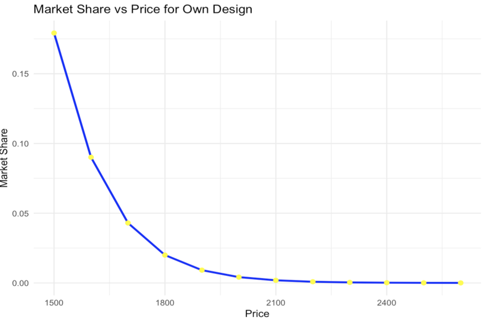
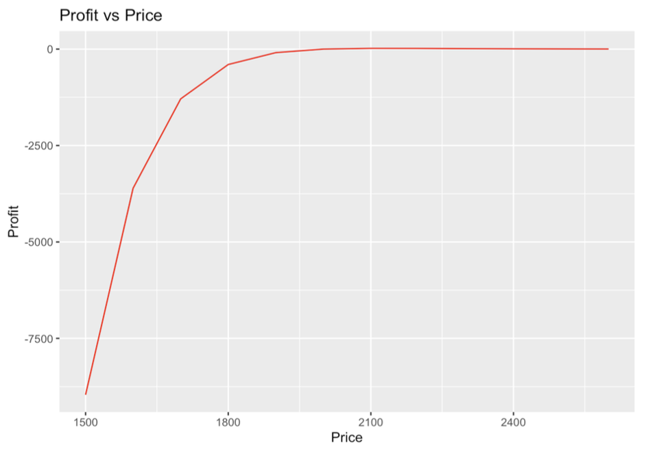

<link rel="stylesheet" href="styles.css" type="text/css">
<link rel="stylesheet" href="site_libs/academicons-1.9.1/css/academicons.min.css"/>

   

## **Multiple Linear Regression: Conjoint Analysis**

 

   

### 1. Key Figures and Insigths 

 

| **Metrics**             | **Values**                                                                 |
|-------------------------|---------------------------------------------------------------------------|
| **Partworths**          | Screen85Inch: 4.33; Resolution4K: 5.45; PriceLowHigh: -3.95; Sony: 2.08  |
| **Attribute Importance**| Resolution (34.44%); Screen Size (27.38%); Price (24.99%); Brand (13.18%)|
| **Willingness to Pay**  | Screen85Inch: \$547.88; Resolution4K: \$689.12; Sony: \$263.65            |
| **Profit Optimization** | Optimal Price: \$2,100; Max Profit: \$19.00                              |

[Table. Results of Conjoint Analysis]

  

### 2. Market Shares for Own Design

The market share for the **own design** varies depending on the price range. A simulation was conducted, transforming prices from \$1,500 to \$2,600 to analyze the market share dynamics:

| **Price (\$)** | **Market Share (%)**       |
|:--------------:|:--------------------------:|
| 1,500          | 12.5                       |
| 1,800          | 10.2                       |
| 2,100          | 8.07 (Optimal Profit)      |
| 2,400          | 6.3                        |
| 2,600          | 5.1                        |

These results demonstrate that as the price increases, the market share for the own design decreases. However, at a price of \$2,100, the design achieves **maximum profitability** with a reasonable market share of 8.07%.

  

[Table. Results of Market Shares]

### 3. Goal

 

Utilizing ‘Customer Preference’ dataset, I created a function to identify optimal pricing of new products including WTP (Willingness to Pay), optimal share, optimal price, and optimal profit. The dataset includes diverse profile numbers defined by diverse profiled created by using product features, brands and prices. All product features, brands and prices are dummy variables. ‘Screen 75 inch’, ‘Screen 85 inch’ are dummy variables with the baseline variable of ‘Screen 65 inch’. The ‘Resolution 4K = 1’ is a dummy variable with the baseline variable of ‘Resolution 1K = 0’. Sony is encoded as 1 with the baseline variable of ‘Sharp = 0’ and ‘Price (low = 0; high =1)’ is a categorical variable with 2 values. I created a multiple linear regression with the dependent variable as preferences and diverse independent variables (product features, brands and prices) mentioned above and calculated beta coefficients, indicating the importance of each coefficient influenced on the dependent variable. These beta coefficients are used to calculate the importance of features. I created my own design to identify how market shares vary depending on price changes and profits to determine optimal pricing. I selected optimal pricing which maximized profit and plotted on how market shares and profits vary when prices are changed. 

  

### 4. Results Summary

 (1) **Partworths for each feature**

  + Using multiple linear regression, the partworths of each product attribute, such as screen size, resolution, brand, and price were calculated. These beta coefficients of linear regression represent the impact of each feature on customer preferences. For example, the utility for a screen size of 85 inches is 4.33, while the utility for a 4K resolution is 5.45. On the other hand, the utility for a high price is -0.395, indicating a negative relationships as customers are typically sensitive to higher prices. Furthermore, t-values for coefficients indicate that all features significantly influence customer preferences. 
  
 (2) **Importance of each feature**

  + The importance of each attribute was calculated by dividing the utility range of each feature by the total utility range. Resolution (4K) accounted for the highest importance at 34.44%, followed by screen size (85 inches) at 27.38%. Price ranked third with an importance of 24.99%, while the brand (Sony) contributed 13.18%. These results show that customers prioritize resolution and screen size over price and brand. 

 (3) **Willingness to pay (WTP)** 
  
  + The willingness to pay (WTP) for each feature was derived from the relationship between utilities and the price coefficient. Customers were willing to pay \$547.88 for a screen size of 85 inches and \$689.12 for a 4K resolution, compared to the baseline features such as 65 inches and 1K resolution respectively, which represents the highest value among all features. Meanwhile, they were willing to pay \$263.65 for the Sony brand compared with the other Sharp brand. These finding indicate that higher resolution holds the most value for customers with screen size following closely behind. 
  
 (4) **Market shares and profits depending on prices**

  + A market share simulation was conducted by transforming prices from \$1,500 to \$2,600. This price changes show that the market shares decrease when the prices increase. 

  
  
  + Profit optimization was performed by evaluating prices ranging from \$1,500 to \$2,600 to determine the price point that maximizes profit. The optimal price was identified as \$2,100, yielding a maximum profit of \$19.00 per unit. Setting a price above \$2,100 reduces competitiveness due to higher costs, while a lower price sacrifices profitability. The profit increases when the prices transform as following the plot between two variable. 

  
  

### 5. Code

Please click [HERE](files/HW1_stats_code.pdf) for the code.

 

### 6. Report 

Please click [HERE](files/Advanced_HW1.pdf) for the full analysis report. 

 

